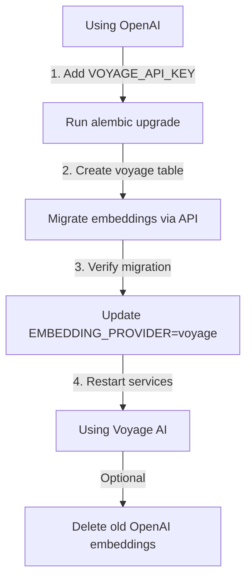

# Dual Embedding System: OpenAI + Voyage AI

## Overview

The system now supports **both OpenAI and Voyage AI embeddings** running simultaneously, allowing you to:
- Keep your existing OpenAI embeddings intact
- Generate new Voyage AI embeddings alongside them
- Switch between providers via environment variable
- Migrate embeddings between providers via API

## Architecture

### Two Separate Tables

```
┌─────────────────────────────────────────────────────────────┐
│                    DUAL EMBEDDING TABLES                    │
├──────────────────────────────┬──────────────────────────────┤
│  data_llamaindex_embeddings  │  data_llamalite_embeddings   │
│        (OpenAI Table)        │       (Voyage AI Table)      │
├──────────────────────────────┼──────────────────────────────┤
│ • Vector(1536) dimensions    │ • Vector(512) dimensions     │
│ • text-embedding-3-small     │ • voyage-3.5-lite           │
│ • Existing embeddings safe   │ • New embeddings            │
│ • LlamaIndexEmbedding model  │ • VoyageLiteEmbedding model │
└──────────────────────────────┴──────────────────────────────┘
```

### Provider Selection

The `EMBEDDING_PROVIDER` environment variable controls which table and model to use:

```bash
# Use OpenAI (default)
EMBEDDING_PROVIDER=openai

# Use Voyage AI
EMBEDDING_PROVIDER=voyage
```

## Configuration

### Environment Variables

```bash
# Required for both providers
OPENAI_API_KEY=sk-...

# Required only if using Voyage AI
VOYAGE_API_KEY=pa-...

# Provider selection (default: openai)
EMBEDDING_PROVIDER=openai  # or "voyage"

# Model configurations (set automatically based on provider)
EMBEDDING_MODEL=text-embedding-3-small  # or "voyage-3.5-lite"
VECTOR_DIMENSION=1536  # or 512 for voyage
```

### Provider-Specific Configuration

The system automatically configures based on `EMBEDDING_PROVIDER`:

| Provider | Model | Dimensions | Table | API Key |
|----------|-------|------------|-------|---------|
| `openai` | text-embedding-3-small | 1536 | data_llamaindex_embeddings | OPENAI_API_KEY |
| `voyage` | voyage-3.5-lite | 512 | data_llamalite_embeddings | VOYAGE_API_KEY |

## Setup Instructions

### Step 1: Run Migration to Create Voyage Table

```bash
# This creates the new data_llamalite_embeddings table
# Your existing OpenAI embeddings are NOT affected
poetry run alembic upgrade head
```

### Step 2: Choose Your Provider

**Option A: Continue with OpenAI (Default)**
```bash
# .env file
EMBEDDING_PROVIDER=openai
OPENAI_API_KEY=sk-...
```

**Option B: Switch to Voyage AI**
```bash
# .env file
EMBEDDING_PROVIDER=voyage
VOYAGE_API_KEY=pa-...
OPENAI_API_KEY=sk-...  # Still needed for LLM
```

### Step 3: Generate Embeddings

**For New Data:**
- Simply ingest data as normal
- Embeddings will be generated using the configured provider
- Data goes into the appropriate table automatically

**For Existing Data:**
- Use the migration API to convert between providers
- See "Migration API" section below

## Migration API

### Migrate Embeddings Between Providers

**Endpoint:** `POST /api/v1/embeddings/migrate`

Regenerates embeddings using the target provider's model and copies them to the target table.

#### Migrate All Embeddings

```bash
curl -X POST "http://localhost:8000/api/v1/embeddings/migrate" \
  -H "Authorization: Bearer YOUR_TOKEN" \
  -H "Content-Type: application/json" \
  -d '{
    "source_provider": "openai",
    "target_provider": "voyage"
  }'
```

#### Migrate Specific User's Embeddings

```bash
curl -X POST "http://localhost:8000/api/v1/embeddings/migrate" \
  -H "Authorization: Bearer YOUR_TOKEN" \
  -H "Content-Type: application/json" \
  -d '{
    "source_provider": "openai",
    "target_provider": "voyage",
    "user_id": "550e8400-e29b-41d4-a716-446655440000"
  }'
```

#### Migrate Specific Persona's Embeddings

```bash
curl -X POST "http://localhost:8000/api/v1/embeddings/migrate" \
  -H "Authorization: Bearer YOUR_TOKEN" \
  -H "Content-Type: application/json" \
  -d '{
    "source_provider": "openai",
    "target_provider": "voyage",
    "persona_id": "660e8400-e29b-41d4-a716-446655440000"
  }'
```

### Check Embedding Statistics

**Endpoint:** `GET /api/v1/embeddings/stats`

Get counts and statistics for both embedding tables.

```bash
curl -X GET "http://localhost:8000/api/v1/embeddings/stats" \
  -H "Authorization: Bearer YOUR_TOKEN"
```

**Response:**
```json
{
  "current_provider": "openai",
  "openai": {
    "model": "text-embedding-3-small",
    "dimensions": 1536,
    "table": "data_llamaindex_embeddings",
    "total_embeddings": 15000,
    "user_embeddings": 1200
  },
  "voyage": {
    "model": "voyage-3.5-lite",
    "dimensions": 512,
    "table": "data_llamalite_embeddings",
    "total_embeddings": 0,
    "user_embeddings": 0
  }
}
```

## Migration Workflow

### From OpenAI to Voyage AI



**Steps:**

1. **Add Voyage API Key**
   ```bash
   VOYAGE_API_KEY=pa-your-key-here
   ```

2. **Run Database Migration**
   ```bash
   poetry run alembic upgrade head
   ```

3. **Migrate Embeddings (Optional)**
   ```bash
   # Start migration via API
   curl -X POST "http://localhost:8000/api/v1/embeddings/migrate" \
     -H "Authorization: Bearer YOUR_TOKEN" \
     -d '{"source_provider": "openai", "target_provider": "voyage"}'
   ```

4. **Switch Provider**
   ```bash
   # Update .env
   EMBEDDING_PROVIDER=voyage
   
   # Restart services
   docker-compose restart
   ```

5. **Optional: Clean Up Old Embeddings**
   ```sql
   -- After verifying Voyage embeddings work
   TRUNCATE TABLE data_llamaindex_embeddings;
   ```

### From Voyage AI back to OpenAI

Simply reverse the process:
1. Set `EMBEDDING_PROVIDER=openai`
2. Optionally migrate embeddings from `voyage` to `openai`

## Benefits of Dual System

### 1. **Zero Downtime**
- Keep existing embeddings working while testing new provider
- No data loss during migration

### 2. **A/B Testing**
- Compare retrieval quality between providers
- Test performance differences
- Validate before full migration

### 3. **Flexibility**
- Switch providers instantly via env var
- Roll back if needed
- Use different providers for different use cases

### 4. **Data Safety**
- Original embeddings preserved
- Migration doesn't delete source data
- Can maintain both providers indefinitely

## Cost Comparison

| Aspect | OpenAI | Voyage AI |
|--------|--------|-----------|
| **Dimensions** | 1536 | 512 (66% smaller) |
| **Storage per embedding** | ~6KB | ~2KB (66% less) |
| **Generation cost** | $0.020 / 1M tokens | More cost-effective |
| **Retrieval speed** | Good | Faster (smaller vectors) |
| **Quality** | Excellent | Optimized for RAG |

**Example Storage Savings:**
- 100,000 embeddings with OpenAI: ~600 MB
- 100,000 embeddings with Voyage: ~200 MB
- **Savings: 400 MB (66% reduction)**

## Technical Details

### Database Models

```python
# OpenAI embeddings (1536 dimensions)
class LlamaIndexEmbedding(Base):
    __tablename__ = "data_llamaindex_embeddings"
    embedding: Mapped[Optional[Vector]] = mapped_column(Vector(1536))

# Voyage AI embeddings (512 dimensions)
class VoyageLiteEmbedding(Base):
    __tablename__ = "data_llamalite_embeddings"
    embedding: Mapped[Optional[Vector]] = mapped_column(Vector(512))
```

### RAG System Configuration

The `LlamaRAGSystem` automatically configures based on `EMBEDDING_PROVIDER`:

```python
# Gets config from settings.get_embedding_config
{
    "provider": "openai",  # or "voyage"
    "model": "text-embedding-3-small",  # or "voyage-3.5-lite"
    "dimension": 1536,  # or 512
    "table_name": "llamaindex_embeddings",  # or "llamalite_embeddings"
    "api_key": "sk-...",  # or voyage key
}
```

### Vector Store Initialization

```python
# Automatically uses correct table and dimension
self.vector_store = PGVectorStore.from_params(
    table_name=embedding_config["table_name"],
    embed_dim=embedding_config["dimension"],
    # ... other params
)
```

## Troubleshooting

### "Table data_llamalite_embeddings does not exist"

**Solution:** Run the migration:
```bash
poetry run alembic upgrade head
```

### "VOYAGE_API_KEY not configured"

**Solution:** Add to `.env` if using Voyage:
```bash
VOYAGE_API_KEY=pa-your-key-here
```

### Embeddings not being generated

**Check:**
1. Correct `EMBEDDING_PROVIDER` set
2. Appropriate API key configured
3. Services restarted after config change

### Migration taking too long

**Solution:** Migrate in smaller batches:
```bash
# Migrate one persona at a time
curl -X POST ".../migrate" \
  -d '{"source_provider": "openai", "target_provider": "voyage", "persona_id": "..."}'
```

## Best Practices

### 1. Test Before Full Migration
- Start with one persona
- Verify retrieval quality
- Compare performance

### 2. Monitor Both Tables
- Use `/embeddings/stats` endpoint
- Check database sizes
- Monitor API costs

### 3. Gradual Migration
- Migrate users incrementally
- Keep OpenAI as fallback
- Delete old embeddings only after validation

### 4. Backup Before Migration
```bash
# Backup OpenAI embeddings table
pg_dump -t data_llamaindex_embeddings your_db > openai_embeddings_backup.sql
```

## Summary

✅ **Two embedding systems running side-by-side**  
✅ **Switch between providers via environment variable**  
✅ **Migrate embeddings via API endpoint**  
✅ **Zero data loss during transition**  
✅ **Flexible rollback if needed**

---

**Quick Start:** Set `EMBEDDING_PROVIDER=openai` (default) and everything continues working. Add `VOYAGE_API_KEY` and set `EMBEDDING_PROVIDER=voyage` when ready to switch.
