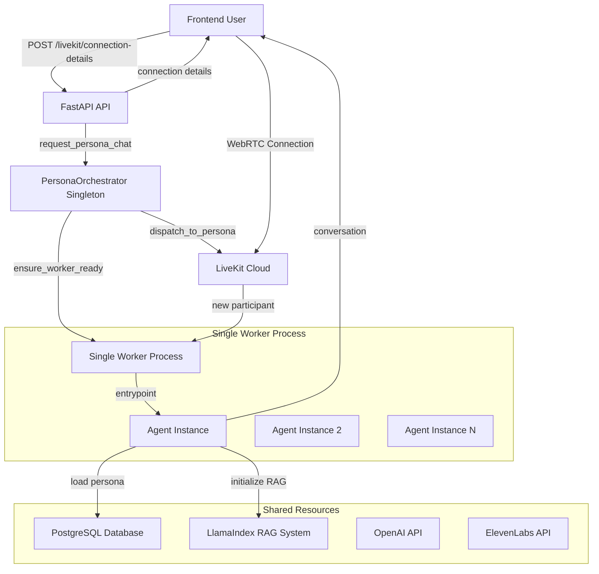

# LiveKit Agent System - Actual Implementation Guide

> **Complete documentation of how the LiveKit agent system is actually implemented in this codebase, from initial request to worker agent creation.**

## Table of Contents

1. [System Overview](#system-overview)
2. [Architecture Summary](#architecture-summary)
3. [Complete Request Flow](#complete-request-flow)
4. [Component Details](#component-details)
5. [Database Models](#database-models)
6. [Process Management](#process-management)
7. [Session Management](#session-management)
8. [Error Handling](#error-handling)
9. [Monitoring & Health Checks](#monitoring--health-checks)
10. [Limitations & Trade-offs](#limitations--trade-offs)

---

## System Overview

The LiveKit agent system uses a **single-worker, multi-persona architecture** where:

- **ONE** Python subprocess handles ALL personas and users
- **Dynamic persona loading** occurs when users connect (not pre-spawned workers)
- **Shared resources** (RAG system, database pool, API clients) across all agent instances
- **Simple orchestration** with manual recovery for failed workers

### Key Design Principle
**Simplicity over scalability** - prioritizes resource efficiency and development simplicity over high availability and horizontal scaling.

---

## Architecture Summary



---

## Complete Request Flow

### 1. User Initiates Voice Chat

**What happens**: When a user clicks "Start Voice Chat" on the frontend, this endpoint is called to set up everything needed for the voice conversation.

**Endpoint**: `POST /api/v1/livekit/connection-details`  
**File**: `app/api/livekit_routes.py:25`

```python
@router.post("/connection-details")
async def get_connection_details(request: ConnectionDetailsRequest):
    """
    Creates LiveKit connection for voice chat with a specific persona.
    
    This is the entry point for all voice conversations. It sets up the "room"
    where the user and AI persona will meet, similar to creating a Zoom meeting.
    
    Flow:
    1. Validate persona exists in database
    2. Generate unique room name and user ID
    3. Create LiveKit access token with metadata
    4. Trigger agent orchestration
    5. Return connection details to frontend
    """
    
    # Step 1: Validate persona exists
    # We need to ensure the persona (e.g., "john_doe") actually exists
    # before setting up a voice chat with them
    persona = await persona_repo.get_by_username(request.expert_username)
    if not persona:
        raise HTTPException(404, "Persona not found")
    
    # Step 2: Generate unique identifiers
    # user_id: Identifies this specific user in the voice chat
    # room_name: Unique room where this conversation will happen
    #           Format: "persona-{UUID}-user-{ID}-{timestamp}"
    #           This ensures no two conversations share the same room
    user_id = f"voice_assistant_user_{random.randint(1, 10000)}"
    room_name = f"persona-{persona.id}-user-{user_id}-{int(time.time())}"
    
    # Step 3: Create LiveKit access token with metadata
    # This token is like a ticket that allows the user to join the room.
    # The metadata tells our worker WHO this user wants to talk to.
    participant_metadata = {
        "expert_username": request.expert_username,  # Who they want to talk to
        "persona_id": str(persona.id),               # Database ID of the persona
        "user_id": user_id,                          # This user's identifier
    }
    
    # Build the JWT token that LiveKit requires for authentication
    # This token includes:
    # - User's identity
    # - Which room they can join
    # - Metadata about the persona they want to talk to
    access_token = livekit_api.AccessToken() \
        .with_identity(user_id) \
        .with_name("user") \
        .with_grants(livekit_api.VideoGrants(room=room_name, room_join=True)) \
        .with_metadata(json.dumps(participant_metadata)) \
        .to_jwt()
    
    # Step 4: Orchestrate agent assignment
    # This tells our system: "Get ready, a user is about to join this room
    # and wants to talk to this specific persona"
    # The orchestrator will ensure our worker is running and create a dispatch
    await orchestrator.request_persona_chat(
        user_id=user_id,
        persona_id=persona.id,
        agent_name=settings.livekit_agent_name,  # Which agent type to use
        room_name=room_name,                      # Which room they'll join
    )
    
    # Step 5: Return connection details to frontend
    # The frontend needs these details to establish the WebRTC connection
    return ConnectionDetailsResponse(
        serverUrl=livekit_url,      # Where to connect (LiveKit server URL)
        roomName=room_name,          # Which room to join
        participantName="user",     # Display name in the room
        participantToken=access_token,  # Authentication token
    )
```

### 2. Agent Orchestration

**What happens**: The orchestrator is like a manager that ensures we have a worker ready to handle conversations. It's a singleton (only one instance exists) that manages THE single worker process.

**Singleton Manager**: `PersonaOrchestrator`  
**File**: `app/services/livekit_orchestrator.py:33`

```python
class PersonaOrchestrator:
    """
    Central singleton managing THE single worker process.
    
    Think of this as the "manager" of a call center with only ONE employee.
    It makes sure that employee is at their desk and ready to take calls.
    
    Key responsibilities:
    - Ensure single worker is running and healthy
    - Route user requests to the worker
    - Monitor worker health and restart if needed
    - Track active rooms in database
    """
    
    def __init__(self):
        # CRITICAL DESIGN DECISION: Only ONE worker, not multiple
        # This means all users share the same Python process
        # Pro: Simple, resource-efficient
        # Con: Single point of failure
        self.worker: Optional[WorkerInfo] = None  # Will hold info about THE worker
        
        # The worker always runs on port 8080
        # If we had multiple workers, each would need a different port
        self.base_port = 8080  
        
        # LiveKit API client for creating "dispatches" (routing rules)
        self.livekit_api = RoomService(livekit_url, livekit_api_key, livekit_api_secret)
        
        # Database interface for tracking workers and active rooms
        self.db = LiveKitDatabase()
    
    async def request_persona_chat(self, user_id, persona_id, agent_name, room_name):
        """
        Main orchestration method - prepares everything for a user to chat.
        
        This is called when a user wants to start a voice chat. It ensures
        our worker is ready and tells LiveKit to route the user to our worker.
        
        Think of it like:
        1. Making sure the receptionist is at their desk
        2. Telling the phone system to route this call to our receptionist
        3. Writing down that this call is happening
        """
        
        # Step 1: Ensure worker is running and healthy
        # This checks if our Python subprocess is alive and responding
        # If no worker exists, it starts one
        # If worker is dead, it cleans up and starts a new one
        is_ready = await self.ensure_worker_ready(persona_id)
        if not is_ready:
            # This is bad - it means we couldn't start or verify the worker
            # The user won't be able to have their conversation
            raise Exception("Worker failed to start or become ready")
        
        # Step 2: Create agent dispatch
        # This tells LiveKit: "When someone joins room X, send them to our worker"
        # Without this, LiveKit wouldn't know which worker should handle the room
        await self._dispatch_to_persona(room_name, persona_id, agent_name)
        
        # Step 3: Track active room in database
        # We store which rooms are active so we can:
        # - Clean up if something crashes
        # - Monitor how many conversations are happening
        # - Know which worker is handling which rooms
        await self.db.add_active_room(
            room_name=room_name,
            worker_id=self.worker.worker_db_id,  # Which worker process
            persona_id=persona_id,                # Which persona they're talking to
            user_id=user_id                       # Who is talking
        )
        
        logger.info(f"✅ Persona chat ready for {persona_id} in room {room_name}")
```

### 3. Worker Process Management

**What happens**: When no worker exists or the existing one has died, we need to start a new Python subprocess that will handle all voice conversations.

**Worker Lifecycle**: `PersonaOrchestrator._start_worker()`  
**File**: `app/services/livekit_orchestrator.py:200`

```python
async def _start_worker(self) -> bool:
    """
    Starts THE single worker subprocess that handles all users.
    
    This is like hiring and training a new call center employee.
    We need to:
    - Give them their login credentials (API keys)
    - Tell them where to report for work (LiveKit URL)
    - Wait for them to log in and be ready
    - Record their employee ID in our database
    
    Process:
    1. Clean up stale database records
    2. Prepare environment variables
    3. Start subprocess with proper isolation
    4. Wait for worker registration
    5. Save worker info to database
    """
    
    # Step 1: Clean up any zombie records
    # If a previous worker crashed, there might be stale records in the database
    # saying "Worker on port 8080 is running" when it's actually dead
    await self._cleanup_stale_worker_records(self.base_port)
    
    # Step 2: Prepare subprocess environment
    # The worker needs all these credentials to function:
    # - API keys for AI services (OpenAI, ElevenLabs, etc.)
    # - LiveKit credentials to connect to the streaming service
    # - Database URL to load persona data
    env = os.environ.copy()  # Start with current environment
    env.update({
        "WORKER_PORT": str(self.base_port),           # Port 8080 for health checks
        "AGENT_NAME": settings.livekit_agent_name,    # Identifies this agent type
        "LIVEKIT_URL": self.livekit_url,             # Where to connect (wss://...)
        "LIVEKIT_API_KEY": self.livekit_api_key,     # Authentication
        "LIVEKIT_API_SECRET": self.livekit_api_secret,
        "OPENAI_API_KEY": os.getenv("OPENAI_API_KEY"),        # For GPT-4
        "ELEVENLABS_API_KEY": os.getenv("ELEVENLABS_API_KEY"), # For voice synthesis
        "DEEPGRAM_API_KEY": os.getenv("DEEPGRAM_API_KEY"),    # For speech-to-text
        "DATABASE_URL": settings.database_url,                 # To load personas
    })
    
    # Step 3: Start subprocess with process group isolation
    # This actually launches the Python program that will handle conversations
    process = subprocess.Popen(
        ["python", "livekit/livekit_agent_retrieval.py", "start"],  # The command
        cwd=os.getcwd(),                    # Run in current directory
        env=env,                            # With our prepared environment
        preexec_fn=os.setsid,              # IMPORTANT: Create new process group
                                           # This allows us to kill the worker and all
                                           # its children with one signal
        stdout=subprocess.PIPE,             # Capture output for debugging
        stderr=subprocess.PIPE,
    )
    
    # Step 4: Wait for worker to register with LiveKit
    # The worker needs time to:
    # - Initialize Python imports
    # - Connect to LiveKit
    # - Register as available
    # We poll its health endpoint until it responds
    worker_info = WorkerInfo(
        pid=process.pid,                    # Process ID for monitoring
        port=self.base_port,                # Port for health checks
        agent_name=settings.livekit_agent_name,
        process=process,                    # Process handle for control
    )
    
    # This will retry for up to 60 seconds
    await self._wait_for_worker_registration(worker_info)
    
    # Step 5: Save to database and track
    # Record that this worker is now active so we can:
    # - Monitor its health
    # - Clean up if it crashes
    # - Know which worker is handling which rooms
    worker_db_id = await self.db.save_worker(
        process.pid,                        # Process ID
        self.base_port,                     # Port number
        settings.livekit_agent_name,        # Agent type
        WorkerState.HEALTHY                 # Initial state
    )
    
    # Store the database ID for future updates
    worker_info.worker_db_id = worker_db_id
    self.worker = worker_info  # This is now THE active worker
    
    logger.info(f"✅ Worker started successfully: PID {process.pid}, Port {self.base_port}")
    return True
```

### 4. LiveKit Dispatch Creation

**What happens**: A "dispatch" is LiveKit's way of routing rooms to workers. It's like telling a phone system "when someone calls extension 123, route it to employee Bob".

**Room Routing**: `PersonaOrchestrator._dispatch_to_persona()`  
**File**: `app/services/livekit_orchestrator.py:140`

```python
async def _dispatch_to_persona(self, room_name: str, persona_id: UUID, agent_name: str):
    """
    Creates LiveKit agent dispatch to route specific room to our worker.
    
    This tells LiveKit: "When someone joins room X, send them to agent Y"
    
    Without this dispatch, LiveKit wouldn't know that our worker should
    handle this specific room. It's the critical link between the room
    and our worker process.
    """
    
    try:
        # Create the dispatch request with metadata
        # The metadata helps our worker know which persona to load
        dispatch_request = livekit_api.CreateAgentDispatchRequest(
            agent_name=agent_name,      # Which agent type (matches our worker's registration)
            room=room_name,             # Which room this dispatch is for
            metadata=json.dumps({       # Extra info passed to the worker
                "persona_id": str(persona_id),      # Which persona to be
                "room_name": room_name,             # Room identifier
                "agent_type": "persona_retrieval"   # Type of agent (for future expansion)
            })
        )
        
        # Send dispatch to LiveKit Cloud
        # This is an API call to LiveKit's servers saying:
        # "Route this room to our worker"
        dispatch = await self.livekit_api.create_agent_dispatch(dispatch_request)
        
        logger.info(f"✅ Agent dispatch created: {dispatch.id} for room {room_name}")
        
    except Exception as e:
        # If this fails, the user won't be able to connect
        # Common reasons: LiveKit API down, invalid credentials, room already dispatched
        logger.error(f"❌ Failed to create agent dispatch: {e}")
        raise
```

### 5. Agent Instance Creation

**What happens**: When a user joins the room, LiveKit calls this function in our worker. This is where we create a personalized agent for this specific conversation.

**Per-User Agent**: `entrypoint()` function  
**File**: `livekit/livekit_agent_retrieval.py:573`

```python
async def entrypoint(ctx: JobContext):
    """
    LiveKit job entrypoint - creates one agent instance per connecting user.
    
    This function is called automatically by LiveKit when someone joins a room
    that's been dispatched to our worker. Think of it as the "onboarding process"
    for each new conversation.
    
    Flow:
    1. Connect to LiveKit room
    2. Wait for participant if room is empty
    3. Extract persona username from participant metadata
    4. Load persona data dynamically from database
    5. Create PersonaRetrievalAgent instance
    6. Initialize RAG system
    7. Start LiveKit session
    """
    
    try:
        # Step 1: Connect to the LiveKit room
        # This establishes the WebRTC connection for audio/video streaming
        # AUDIO_ONLY means we only handle voice, not video
        await ctx.connect(auto_subscribe=AutoSubscribe.AUDIO_ONLY)
        logger.info(f"🏠 Connected to room: {ctx.room.name}")
        
        # Step 2: Wait for participant if room is empty
        # Sometimes our agent connects before the user does
        # We wait up to 30 seconds for someone to join
        if len(ctx.room.remote_participants) == 0:
            logger.info("⏳ Room is empty, waiting for participant to join...")
            participant = await ctx.wait_for_participant()  # Timeout: 30 seconds
            if not participant:
                # If no one joins, this conversation is abandoned
                raise TimeoutError("No participant joined the room")
        
        # Step 3: Extract persona username from participant metadata
        # Remember: the API put metadata in the user's token
        # This metadata tells us WHO they want to talk to
        expert_username, session_token = extract_user_info_from_room(ctx.room)
        logger.info(f"🚀 [{expert_username}] Session started in room: {ctx.room.name}")
        
        # Step 4: Load persona data dynamically from database
        # This is the magic - we load the persona's personality on-demand
        # No need to pre-load all personas in memory
        persona = PersonaData(expert_username=expert_username)
        persona_info, pattern_info, persona_prompt = await persona.load_all()
        
        logger.info(f"🎭 [{expert_username}] Loaded persona: {persona_info.get('name', 'Unknown')}")
        
        # Step 5: Create persona-specific agent instance
        # This creates the actual conversation handler with all the persona's traits
        agent = PersonaRetrievalAgent(
            expert_username,                    # Username (e.g., "john_doe")
            persona_info,                       # Basic info (name, role, company, etc.)
            persona_prompt,                     # Custom prompt configuration
            pattern_info,                       # Behavioral patterns (how they talk)
            ctx.room.name,                      # Room name for cleanup later
            ctx.proc.userdata["vad"],          # Voice activity detection (pre-warmed)
        )
        
        # Step 6: Initialize RAG system
        # Load the knowledge retrieval system so the agent can search
        # the persona's uploaded content during conversations
        await agent.initialize()
        
        # Step 7: Start LiveKit session
        # This actually begins the conversation loop:
        # User speaks → Speech-to-text → AI processing → Text-to-speech → User hears
        session = AgentSession()
        
        # Set up metrics collection for monitoring
        @session.on("metrics_collected")
        def _on_metrics_collected(ev: MetricsCollectedEvent):
            # Track conversation quality, latency, etc.
            metrics.log_metrics(ev.metrics)
        
        # Start the conversation! This is where the magic happens
        await session.start(agent=agent, room=ctx.room)
        
        logger.info(f"✅ [{expert_username}] Ready - {agent.persona_info['name']} active")
        
    except Exception as e:
        # If anything goes wrong, log it and crash gracefully
        # The user will see "Connection failed" and can try again
        logger.error(f"Critical error in entrypoint: {e}")
        raise
```

### 6. Dynamic Persona Loading

**What happens**: This is where we load the persona's personality from the database. Each conversation loads fresh data, so personas can be updated without restarting the worker.

**Database Integration**: `PersonaData` class  
**File**: `livekit/livekit_agent_retrieval.py:125`

```python
class PersonaData:
    """
    Handles persona data loading from database.
    
    This class is responsible for fetching everything needed to make
    the AI behave like a specific person:
    - Basic info (name, role, company)
    - Behavioral patterns (how they talk, think)
    - Custom prompts (specific instructions)
    """
    
    def __init__(self, expert_username: str):
        # The username we're looking for (e.g., "john_doe")
        self.persona_username = expert_username
        
        # Storage for loaded data
        self.persona_prompt = None      # Custom prompts
        self.persona_info = {}          # Basic info
        self.patterns_info = {}         # Behavioral patterns
        
        # Flags to track what we've loaded (prevents duplicate queries)
        self._persona_loaded = False
        self._persona_loaded_prompt = False
    
    async def load_all(self) -> tuple[Dict[str, Any], Dict[str, Any], Optional[PersonaPrompt]]:
        """
        Load persona, patterns, and prompts in one call.
        
        This is the main method called by the agent creation process.
        It fetches everything needed to create a personalized agent.
        """
        persona_info = await self.get_persona()        # Basic info
        patterns_info = await self.get_patterns()      # How they behave
        persona_prompt = await self.get_persona_prompt()  # Custom instructions
        return persona_info, patterns_info, persona_prompt
    
    async def get_persona(self) -> Dict[str, Any]:
        """
        Load basic persona information from database.
        
        This fetches the core identity: name, role, company, description, voice.
        These are the fundamental facts about who this persona is.
        """
        async with async_session_maker() as session:
            # Query the personas table by username
            stmt = select(Persona).where(Persona.username == self.persona_username)
            result = await session.execute(stmt)
            persona = result.scalar_one_or_none()  # Get one result or None
            
            if not persona:
                # This persona doesn't exist - the conversation can't continue
                logger.error(f"❌ Persona not found in database: {self.persona_username}")
                raise ValueError(f"Persona not found: {self.persona_username}")
            
            # Mark as loaded and convert to dictionary
            self._persona_loaded = True
            self.persona_info = {
                "id": str(persona.id),                            # Database UUID
                "name": persona.name,                             # "John Doe"
                "role": persona.role or "Expert",                # "Software Engineer"
                "company": persona.company or "Independent",     # "Tech Corp"
                "description": persona.description or "A knowledgeable expert",
                "voice_id": persona.voice_id,                    # ElevenLabs voice ID
            }
            
            return self.persona_info
    
    async def get_patterns(self) -> Dict[str, Any]:
        """
        Load behavioral patterns from database.
        
        Patterns define HOW the persona communicates:
        - Communication style (formal vs casual)
        - Thinking patterns (analytical vs creative)
        - Response patterns (detailed vs brief)
        - Personality markers (enthusiastic vs measured)
        """
        # Ensure we have the basic persona info first
        if not self._persona_loaded:
            await self.get_persona()
        
        persona_id = self.persona_info["id"]
        
        try:
            async with async_session_maker() as session:
                # Query all patterns for this persona
                stmt = select(Pattern).where(Pattern.persona_id == persona_id)
                result = await session.execute(stmt)
                patterns = result.scalars().all()
                
                # Organize patterns by type
                # Example: {"style": {...}, "thinking": {...}, "response": {...}}
                for pattern in patterns:
                    self.patterns_info[pattern.pattern_type] = pattern.pattern_data
                
                return self.patterns_info
                
        except Exception as e:
            # If pattern loading fails, continue without patterns
            # The persona will work but might be less authentic
            logger.error(f"Error getting patterns: {e}")
            return {}
    
    async def get_persona_prompt(self) -> Optional[PersonaPrompt]:
        """Load custom prompt configuration from database"""
        if not self._persona_loaded:
            await self.get_persona()
        
        try:
            async with async_session_maker() as session:
                stmt = select(PersonaPrompt).where(
                    PersonaPrompt.persona_username == self.persona_username
                )
                result = await session.execute(stmt)
                persona_prompt = result.scalar_one_or_none()
                
                if persona_prompt:
                    self._persona_loaded_prompt = True
                    self.persona_prompt = persona_prompt
                else:
                    logger.info(f"No custom prompt found for {self.persona_username}")
                    self.persona_prompt = None
                    
        except Exception as e:
            logger.error(f"Error getting persona prompt: {e}")
            self.persona_prompt = None
        
        return self.persona_prompt
```

---

## Component Details

### PersonaRetrievalAgent Architecture

**File**: `livekit/livekit_agent_retrieval.py:283`

```python
class PersonaRetrievalAgent(Agent):
    """
    Custom LiveKit agent with persona-specific responses and session management.
    
    Architecture:
    - ONE agent instance per LiveKit job (when user connects)
    - Agent handles ONE session but MULTIPLE conversation turns
    - Each turn calls llm_node() with dynamic persona loading
    - Session context persists across turns for conversation continuity
    """
    
    def __init__(self, persona_username, persona_info, persona_prompt_info, patterns_info, room_name, session_token=None, prewarmed_vad=""):
        # Core persona data loaded from database at agent creation
        self.persona_username = persona_username
        self.persona_info = persona_info  # {"id", "name", "role", "company", "description", "voice_id"}
        self.persona_prompt_info = persona_prompt_info
        self.patterns_info = patterns_info  # Persona-specific behavior patterns
        self.room_name = room_name  # Store room name for cleanup
        self.session_token = session_token
        self.persona_id = UUID(persona_info.get("id"))
        self.rag_system = None  # Initialized in initialize()
        
        # Track multiple sessions (though typically one per agent)
        self.session_contexts: Dict[str, SessionContext] = {}
        self.agent_instance_id = id(self)
        
        # Configure voice settings
        voice_id = persona_info.get("voice_id") or os.getenv("ELEVENLABS_VOICE_ID", "CwhRBWXzGAHq8TQ4Fs17")
        
        # Initialize LiveKit agent with persona-specific settings
        super().__init__(
            instructions=f"You are {persona_info['name']}, {persona_info['role']}.",
            vad=prewarmed_vad,
            stt=deepgram.STT(),
            llm=openai.LLM(model="gpt-4o-mini", temperature=0.7),
            tts=elevenlabs.TTS(voice_id=voice_id),
        )
```

### Dynamic System Prompt Generation

**File**: `livekit/livekit_agent_retrieval.py:415`

```python
async def llm_node(self, chat_ctx: llm.ChatContext, tools, model_settings):
    """
    Core LLM processing - called for EACH user message.
    
    Flow:
    1. Get session context (conversation history)
    2. Extract user query from chat context
    3. Retrieve relevant knowledge via RAG
    4. Build dynamic system prompt (persona + history)
    5. Augment user message with RAG context
    6. Call default LLM with enhanced context
    
    This is where the magic happens - each turn gets personalized!
    """
    try:
        # Get unique session identifier
        session_id = str(id(self.session))
        
        # Get conversation history for this specific session
        session_ctx = self.get_or_create_session_context(session_id)
        
        # Build personalized system prompt with conversation history
        dynamic_prompt = self.build_session_specific_prompt(session_ctx)
        
        # Inject dynamic system prompt into chat context
        system_msg = chat_ctx.items[0] if chat_ctx.items else None
        if isinstance(system_msg, llm.ChatMessage) and system_msg.role == "system":
            # Update existing system message
            system_msg.content = [dynamic_prompt]
        else:
            # Insert new system message at the beginning
            chat_ctx.items.insert(
                0, llm.ChatMessage(role="system", content=[dynamic_prompt])
            )
            
    except Exception:
        logger.error(f"[{self.persona_username}] Error in llm_node", exc_info=True)
    
    # Pass execution to parent, otherwise generation breaks
    async for chunk in super().llm_node(chat_ctx, tools, model_settings):
        yield chunk

def build_session_specific_prompt(self, session_ctx: SessionContext) -> str:
    """
    Build dynamic system prompt with persona data + conversation history.
    
    Called for EACH conversation turn to inject:
    1. Full persona instructions (role, patterns, knowledge)
    2. Recent conversation context for continuity
    
    This replaces the static system prompt from __init__
    """
    # Start with full persona-specific system prompt
    if self.persona_prompt_info is None:
        base_prompt = PromptTemplates.build_system_prompt_alt(
            self.persona_info, self.patterns_info
        )
    else:
        base_prompt = PromptTemplates.build_system_prompt_dynamic(
            self.persona_prompt_info, self.persona_info, is_voice=True
        )
    
    return base_prompt
```

### RAG Context Injection

**File**: `livekit/livekit_agent_retrieval.py:464`

```python
async def on_user_turn_completed(self, turn_ctx: llm.ChatContext, new_message: llm.ChatMessage):
    """
    Called after LLM generates response - injects RAG context for next turn.
    
    Flow: llm_node() → LLM generates response → on_user_turn_completed()
    
    This completes the conversation turn by:
    1. Running RAG retrieval on user query
    2. Injecting context for the NEXT turn
    3. Saving conversation history
    """
    user_query = new_message.text_content or ""
    if not user_query.strip():
        await super().on_user_turn_completed(turn_ctx, new_message)
        return
    
    try:
        # Build chat history for context
        chat_history = []
        for item in getattr(turn_ctx, "items", []):
            text = item.text_content or ""
            if text:
                role_name = str(getattr(item, "role", "user")).lower()
                chat_history.append({"role": role_name, "content": text})
        
        # Run RAG retrieval
        logger.info(f"🔎 Running RAG retrieval for user query: '{user_query}'")
        
        context_text = await ContextPipeline(self.rag_system).process(
            persona_id=self.persona_id,
            user_query=user_query,
            top_k=5,
            similarity_threshold=0.3,
            chat_history=chat_history,
        )
        
        if context_text:
            # Inject context for THIS TURN ONLY (ephemeral)
            turn_ctx.add_message(
                role="assistant",
                content=f"Additional information relevant to the user's next message: {context_text}\n",
            )
            logger.info("✅ Injected ephemeral RAG context for this turn.")
        else:
            logger.info("ℹ️ No relevant RAG context found for this turn.")
            
    except Exception as e:
        logger.error(f"❌ RAG retrieval failed: {e}", exc_info=True)
    
    # Always call parent to continue generation process
    await super().on_user_turn_completed(turn_ctx, new_message)
```

---

## Database Models

### Worker Processes Table

**File**: `app/database/models/livekit.py:15`

```python
class WorkerProcess(Base):
    """Tracks the single worker process and its state"""
    
    __tablename__ = "worker_processes"
    
    id = Column(Integer, primary_key=True, autoincrement=True)
    pid = Column(Integer, nullable=False)  # Process ID
    port = Column(Integer, nullable=False, unique=True)  # Fixed port 8080
    agent_name = Column(String(100), nullable=False, unique=True)  # Agent identifier
    state = Column(Enum(WorkerState), nullable=False)  # STARTING/HEALTHY/IDLE/TERMINATED
    started_at = Column(DateTime, nullable=False)
    last_health_check = Column(DateTime, nullable=False)
    last_activity = Column(DateTime, nullable=False)
    active_jobs = Column(Integer, nullable=False, default=0)  # Number of active rooms
    
    # Relationships
    active_rooms = relationship("ActiveRoom", back_populates="worker", cascade="all, delete-orphan")
```

### Active Rooms Table

**File**: `app/database/models/livekit.py:35`

```python
class ActiveRoom(Base):
    """Tracks which rooms are handled by which worker"""
    
    __tablename__ = "active_rooms"
    
    room_name = Column(String(255), primary_key=True)  # Unique room identifier
    worker_id = Column(Integer, ForeignKey("worker_processes.id"), nullable=False)
    persona_id = Column(UUID(as_uuid=True), ForeignKey("personas.id"), nullable=False)
    user_id = Column(String, nullable=False)  # User who joined the room
    created_at = Column(DateTime, nullable=False, default=datetime.utcnow)
    last_activity = Column(DateTime, nullable=False, default=datetime.utcnow)
    
    # Relationships
    worker = relationship("WorkerProcess", back_populates="active_rooms")
    persona = relationship("Persona")
    
    # Indexes for performance
    __table_args__ = (
        Index('ix_active_rooms_worker_id', 'worker_id'),
        Index('ix_active_rooms_persona_id', 'persona_id'),
    )
```

### Worker State Enum

**File**: `app/database/models/livekit.py:8`

```python
class WorkerState(enum.Enum):
    """Worker process states"""
    STARTING = "starting"      # Process starting up, not ready yet
    HEALTHY = "healthy"        # Process running and accepting jobs
    IDLE = "idle"             # No active jobs but still running
    TERMINATED = "terminated"  # Process stopped or crashed
```

---

## Process Management

### Health Monitoring

**Background Task**: `PersonaOrchestrator._monitor_worker_health()`  
**File**: `app/services/livekit_orchestrator.py:350`

```python
async def _monitor_worker_health(self):
    """
    Background task that monitors THE worker's health every 30 seconds.
    
    Checks:
    1. Process is still alive (PID exists)
    2. Process responds to HTTP health check
    3. Updates database with health status
    4. Restarts worker if unhealthy
    """
    while True:
        try:
            await asyncio.sleep(30)  # Check every 30 seconds
            
            if not self.worker:
                continue
                
            # Check if process is still alive
            try:
                os.kill(self.worker.pid, 0)  # Signal 0 checks if process exists
            except (OSError, ProcessLookupError):
                logger.error(f"❌ Worker process {self.worker.pid} is dead")
                await self._handle_dead_worker()
                continue
            
            # Check HTTP health endpoint
            try:
                async with aiohttp.ClientSession() as session:
                    async with session.get(
                        f"http://localhost:{self.worker.port}/health",
                        timeout=aiohttp.ClientTimeout(total=5)
                    ) as response:
                        if response.status == 200:
                            # Update database health status
                            await self.db.update_worker_health(
                                self.worker.worker_db_id, 
                                WorkerState.HEALTHY
                            )
                        else:
                            logger.warning(f"⚠️ Worker health check failed: {response.status}")
                            
            except Exception as e:
                logger.error(f"❌ Worker health check failed: {e}")
                await self._handle_unhealthy_worker()
                
        except Exception as e:
            logger.error(f"Error in health monitoring: {e}")
```

### Worker Recovery

**File**: `app/services/livekit_orchestrator.py:400`

```python
async def _handle_dead_worker(self):
    """
    Handles recovery when THE worker process dies.
    
    Steps:
    1. Clean up database records
    2. Terminate zombie process if exists
    3. Clear active rooms
    4. Reset worker reference
    5. Log incident for manual intervention
    """
    logger.error("🚨 Worker process died - cleaning up and requiring manual restart")
    
    if self.worker:
        # Update database state
        await self.db.update_worker_state(
            self.worker.worker_db_id, 
            WorkerState.TERMINATED
        )
        
        # Clean up active rooms
        await self.db.clear_worker_rooms(self.worker.worker_db_id)
        
        # Attempt to kill zombie process
        try:
            if self.worker.process and self.worker.process.poll() is None:
                os.killpg(os.getpgid(self.worker.process.pid), signal.SIGTERM)
                await asyncio.sleep(5)
                if self.worker.process.poll() is None:
                    os.killpg(os.getpgid(self.worker.process.pid), signal.SIGKILL)
        except Exception as e:
            logger.error(f"Error cleaning up dead worker process: {e}")
        
        # Clear worker reference
        self.worker = None
    
    logger.error("💀 Worker cleanup complete - manual restart required")
```

### Graceful Shutdown

**File**: `app/services/livekit_orchestrator.py:450`

```python
async def shutdown(self):
    """
    Graceful shutdown of THE worker process and cleanup.
    
    Called during application shutdown to ensure clean termination.
    """
    logger.info("🛑 Shutting down PersonaOrchestrator...")
    
    if self.worker and self.worker.process:
        try:
            # Send SIGTERM to process group
            os.killpg(os.getpgid(self.worker.process.pid), signal.SIGTERM)
            
            # Wait up to 10 seconds for graceful shutdown
            try:
                await asyncio.wait_for(self.worker.process.wait(), timeout=10.0)
                logger.info("✅ Worker shutdown gracefully")
            except asyncio.TimeoutError:
                # Force kill if graceful shutdown fails
                logger.warning("⚠️ Worker didn't shutdown gracefully, force killing")
                os.killpg(os.getpgid(self.worker.process.pid), signal.SIGKILL)
                await self.worker.process.wait()
            
            # Update database
            await self.db.update_worker_state(
                self.worker.worker_db_id, 
                WorkerState.TERMINATED
            )
            
        except Exception as e:
            logger.error(f"Error during worker shutdown: {e}")
        
        finally:
            self.worker = None
    
    logger.info("✅ PersonaOrchestrator shutdown complete")
```

---

## Session Management

### Session Context Tracking

**File**: `livekit/livekit_agent_retrieval.py:234`

```python
class SessionContext:
    """
    Manages per-session context and conversation history.
    
    Each LiveKit session gets its own SessionContext to maintain:
    - Conversation history across multiple turns
    - Retrieved RAG contexts for each query
    - Session timing and activity tracking
    """
    
    def __init__(self, session_id: str, persona_id: UUID):
        self.session_id = session_id
        self.persona_id = persona_id
        # Store conversation turns: [{"turn": 1, "query": "...", "context": {...}, "response": "..."}]
        self.conversation_history = []
        # Store RAG contexts for analysis (currently unused)
        self.retrieved_contexts = []
        self.turn_count = 0
        self.created_at = time.time()
        self.last_activity = time.time()
    
    def add_turn(self, query: str, context: Dict[str, Any], response: Optional[str] = None):
        """
        Track conversation turns with retrieved context.
        
        Called from llm_node() with user query and RAG context.
        Response is initially None, then updated by on_user_turn_completed()
        """
        self.turn_count += 1
        self.last_activity = time.time()
        turn_data = {
            "turn": self.turn_count,
            "query": query,
            "context": context,  # RAG chunks and metadata
            "response": response,  # Initially None, filled later
        }
        self.conversation_history.append(turn_data)
    
    def get_recent_context(self, n: int = 3) -> list:
        """
        Get recent conversation context for continuity.
        
        Used by build_session_specific_prompt() to give the AI
        memory of recent conversation turns for better responses.
        """
        return self.conversation_history[-n:] if self.conversation_history else []
```

### Room Cleanup on Exit

**File**: `livekit/livekit_agent_retrieval.py:536`

```python
async def on_exit(self):
    """
    Called when the agent is shutting down/exiting.
    
    Cleans up active room records from database to prevent stale entries.
    """
    logger.info(f"🚪 [{self.persona_username}] Agent is closing - goodbye! 👋")
    
    try:
        if self.room_name:
            logger.info(f"🧹 [{self.persona_username}] Cleaning up room: {self.room_name}")
            
            # Import here to avoid circular imports
            from app.database.repositories.livekit_repository import LiveKitDatabase
            
            db = LiveKitDatabase()
            await db.remove_active_room(self.room_name)
            logger.info(f"✅ [{self.persona_username}] Room {self.room_name} cleaned up from database")
        else:
            logger.warning(f"⚠️ [{self.persona_username}] No room name available for cleanup")
            
    except Exception as e:
        logger.error(f"❌ [{self.persona_username}] Failed to clean up room: {e}")
        # Don't raise - we don't want cleanup failures to break agent shutdown
    
    # Call parent cleanup
    await super().on_exit()
```

---

## Error Handling

### Worker Startup Failures

**File**: `app/services/livekit_orchestrator.py:120`

```python
async def ensure_worker_ready(self, persona_id: UUID) -> bool:
    """
    Ensures THE single worker is running and healthy.
    
    Handles various failure scenarios:
    1. No worker exists -> Start new worker
    2. Worker process died -> Clean up and start new worker
    3. Worker unhealthy -> Restart worker
    4. Worker healthy -> Return immediately
    """
    
    # Check if we have a worker reference
    if not self.worker:
        logger.info("🚀 No worker found, starting new worker...")
        return await self._start_worker()
    
    # Check if worker process is still alive
    try:
        os.kill(self.worker.pid, 0)  # Signal 0 checks if process exists
    except (OSError, ProcessLookupError):
        logger.error(f"❌ Worker process {self.worker.pid} is dead, restarting...")
        await self._handle_dead_worker()
        return await self._start_worker()
    
    # Check worker health via HTTP
    try:
        async with aiohttp.ClientSession() as session:
            async with session.get(
                f"http://localhost:{self.worker.port}/health",
                timeout=aiohttp.ClientTimeout(total=5)
            ) as response:
                if response.status == 200:
                    logger.info(f"✅ Worker {self.worker.pid} is healthy")
                    return True
                else:
                    logger.warning(f"⚠️ Worker health check failed: {response.status}")
                    return await self._restart_unhealthy_worker()
                    
    except Exception as e:
        logger.error(f"❌ Worker health check failed: {e}")
        return await self._restart_unhealthy_worker()

async def _restart_unhealthy_worker(self) -> bool:
    """Restart worker when health checks fail"""
    logger.info("🔄 Restarting unhealthy worker...")
    
    try:
        # Graceful shutdown first
        if self.worker and self.worker.process:
            os.killpg(os.getpgid(self.worker.process.pid), signal.SIGTERM)
            await asyncio.sleep(5)
            
            # Force kill if still alive
            if self.worker.process.poll() is None:
                os.killpg(os.getpgid(self.worker.process.pid), signal.SIGKILL)
                await self.worker.process.wait()
        
        # Clean up database
        if self.worker:
            await self.db.update_worker_state(
                self.worker.worker_db_id, 
                WorkerState.TERMINATED
            )
            await self.db.clear_worker_rooms(self.worker.worker_db_id)
        
        # Start new worker
        self.worker = None
        return await self._start_worker()
        
    except Exception as e:
        logger.error(f"❌ Failed to restart worker: {e}")
        return False
```

### Agent Initialization Failures

**File**: `livekit/livekit_agent_retrieval.py:352`

```python
async def initialize(self):
    """
    Initialize RAG system for the agent.
    
    Handles RAG system failures gracefully - allows agent to work without RAG if needed.
    """
    try:
        self.rag_system = await get_rag_system()
        logger.info(f"[{self.persona_username}] RAG system initialized successfully")
    except Exception as e:
        logger.error(
            f"[{self.persona_username}] Failed to initialize RAG system: {e}",
            exc_info=True,
        )
        # Don't raise - allow agent to work without RAG if needed
        self.rag_system = None
        logger.warning(
            f"[{self.persona_username}] Agent will operate without RAG system"
        )
```

### Database Connection Failures

**File**: `app/services/livekit_orchestrator.py:500`

```python
async def _wait_for_worker_registration(self, worker_info: WorkerInfo, timeout: int = 60):
    """
    Wait for worker to register with LiveKit and become ready.
    
    Handles various registration failure scenarios with retries.
    """
    start_time = time.time()
    
    while time.time() - start_time < timeout:
        try:
            # Check if process is still alive
            if worker_info.process.poll() is not None:
                # Process died during startup
                stdout, stderr = worker_info.process.communicate()
                logger.error(f"❌ Worker process died during startup:")
                logger.error(f"STDOUT: {stdout.decode() if stdout else 'None'}")
                logger.error(f"STDERR: {stderr.decode() if stderr else 'None'}")
                raise Exception("Worker process died during startup")
            
            # Check health endpoint
            async with aiohttp.ClientSession() as session:
                async with session.get(
                    f"http://localhost:{worker_info.port}/health",
                    timeout=aiohttp.ClientTimeout(total=2)
                ) as response:
                    if response.status == 200:
                        logger.info(f"✅ Worker registered and ready on port {worker_info.port}")
                        return True
                        
        except Exception as e:
            # Expected during startup - worker might not be ready yet
            pass
        
        await asyncio.sleep(2)  # Check every 2 seconds
    
    # Timeout reached
    logger.error(f"❌ Worker failed to register within {timeout} seconds")
    
    # Kill the failed process
    try:
        if worker_info.process and worker_info.process.poll() is None:
            os.killpg(os.getpgid(worker_info.process.pid), signal.SIGKILL)
    except Exception as e:
        logger.error(f"Error killing failed worker process: {e}")
    
    raise TimeoutError(f"Worker failed to register within {timeout} seconds")
```

---

## Monitoring & Health Checks

### Database Health Tracking

**File**: `app/database/repositories/livekit_repository.py:45`

```python
class LiveKitDatabase:
    """Database operations for LiveKit worker and room management"""
    
    async def update_worker_health(self, worker_id: int, state: WorkerState):
        """Update worker health status and last check time"""
        async with async_session_maker() as session:
            stmt = (
                update(WorkerProcess)
                .where(WorkerProcess.id == worker_id)
                .values(
                    state=state,
                    last_health_check=datetime.utcnow(),
                    last_activity=datetime.utcnow(),
                )
            )
            await session.execute(stmt)
            await session.commit()
    
    async def get_worker_metrics(self, worker_id: int) -> Dict[str, Any]:
        """Get comprehensive worker metrics for monitoring"""
        async with async_session_maker() as session:
            # Get worker info
            worker_stmt = select(WorkerProcess).where(WorkerProcess.id == worker_id)
            worker_result = await session.execute(worker_stmt)
            worker = worker_result.scalar_one_or_none()
            
            if not worker:
                return {}
            
            # Get active rooms count
            rooms_stmt = select(func.count(ActiveRoom.room_name)).where(
                ActiveRoom.worker_id == worker_id
            )
            rooms_result = await session.execute(rooms_stmt)
            active_rooms_count = rooms_result.scalar()
            
            # Calculate uptime
            uptime_seconds = (datetime.utcnow() - worker.started_at).total_seconds()
            
            return {
                "worker_id": worker.id,
                "pid": worker.pid,
                "port": worker.port,
                "state": worker.state.value,
                "uptime_seconds": uptime_seconds,
                "active_rooms": active_rooms_count,
                "last_health_check": worker.last_health_check.isoformat(),
                "last_activity": worker.last_activity.isoformat(),
            }
```

### Application Health Endpoint

**File**: `app/api/livekit_routes.py:150`

```python
@router.get("/health")
async def get_livekit_health():
    """
    Health check endpoint for LiveKit system status.
    
    Returns comprehensive health information about:
    - Worker process status
    - Active rooms count
    - System metrics
    """
    try:
        orchestrator = get_livekit_orchestrator()
        
        if not orchestrator.worker:
            return {
                "status": "unhealthy",
                "message": "No worker process running",
                "worker": None,
                "active_rooms": 0,
                "timestamp": datetime.utcnow().isoformat(),
            }
        
        # Get worker metrics
        metrics = await orchestrator.db.get_worker_metrics(
            orchestrator.worker.worker_db_id
        )
        
        # Check process health
        is_alive = True
        try:
            os.kill(orchestrator.worker.pid, 0)
        except (OSError, ProcessLookupError):
            is_alive = False
        
        status = "healthy" if is_alive and metrics.get("state") == "healthy" else "unhealthy"
        
        return {
            "status": status,
            "message": "Worker running" if is_alive else "Worker process dead",
            "worker": metrics,
            "active_rooms": metrics.get("active_rooms", 0),
            "timestamp": datetime.utcnow().isoformat(),
        }
        
    except Exception as e:
        logger.error(f"Health check failed: {e}")
        return {
            "status": "error",
            "message": str(e),
            "worker": None,
            "active_rooms": 0,
            "timestamp": datetime.utcnow().isoformat(),
        }
```

### Metrics Collection

**File**: `livekit/livekit_agent_retrieval.py:654`

```python
@session.on("metrics_collected")
def _on_metrics_collected(ev: MetricsCollectedEvent):
    """
    Collect and log LiveKit agent metrics.
    
    Tracks conversation quality and performance metrics.
    """
    metrics.log_metrics(ev.metrics)
    
    # Additional custom metrics could be logged here:
    # - RAG retrieval latency
    # - Persona loading time
    # - Voice synthesis quality
    # - User engagement metrics
```

---

## Limitations & Trade-offs

### Current Architecture Limitations

1. **Single Point of Failure**
   - If THE worker process dies, ALL active users lose their connections
   - No redundancy or failover mechanism
   - Manual intervention required for recovery

2. **No Horizontal Scaling**
   - Fixed single worker can't handle high loads
   - All computation happens in one process
   - Resource contention between users

3. **Resource Sharing Issues**
   - All users share the same API rate limits (OpenAI, ElevenLabs)
   - Database connection pool contention
   - Memory usage grows linearly with concurrent users

4. **Manual Recovery Required**
   - No automatic worker restart on failure
   - Database cleanup requires manual intervention
   - Stale room records can accumulate

5. **Process Management Complexity**
   - Subprocess management with proper signal handling
   - Process group isolation for clean shutdown
   - Zombie process cleanup

### Design Trade-offs

**Simplicity vs. Reliability**
- ✅ **Chosen**: Simple single-worker architecture
- ❌ **Sacrificed**: High availability and fault tolerance

**Resource Efficiency vs. Scalability**
- ✅ **Chosen**: Shared resources and connections
- ❌ **Sacrificed**: Ability to scale horizontally

**Development Speed vs. Production Readiness**
- ✅ **Chosen**: Quick to implement and understand
- ❌ **Sacrificed**: Production-grade reliability features

### When This Architecture Works

**Good for:**
- ✅ Development and testing environments
- ✅ Small to medium user loads (< 50 concurrent users)
- ✅ Prototype and MVP scenarios
- ✅ Teams that prioritize development speed

**Not suitable for:**
- ❌ High-availability production systems
- ❌ Large-scale user bases (> 100 concurrent users)
- ❌ Mission-critical applications requiring 99.9% uptime
- ❌ Multi-region deployments

### Future Architecture Considerations

For production scale, consider:

1. **Multi-Worker Architecture**
   - Horizontal scaling with multiple worker processes
   - Load balancing across workers
   - Worker health monitoring and auto-restart

2. **Containerization & Orchestration**
   - Docker containers for worker isolation
   - Kubernetes for orchestration and scaling
   - Service mesh for communication

3. **Message Queue Integration**
   - Redis/RabbitMQ for job distribution
   - Async task processing
   - Worker pool management

4. **Database Optimizations**
   - Connection pooling improvements
   - Read replicas for RAG queries
   - Caching layers (Redis)

5. **Monitoring & Observability**
   - Prometheus metrics collection
   - Distributed tracing (Jaeger)
   - Real-time alerting

---

## Summary

This LiveKit agent system implements a **single-worker, multi-persona architecture** that prioritizes simplicity and resource efficiency over scalability and high availability. 

**Key characteristics:**
- ONE subprocess handles ALL users and personas
- Dynamic persona loading from database when users connect
- Shared resources (RAG, database, API clients) across all sessions
- Manual process management with basic health monitoring
- Simple but fragile - suitable for development and moderate production loads

**The complete flow:** User requests connection → API validates persona → Orchestrator ensures worker ready → LiveKit routes user to worker → Worker creates agent instance → Agent loads persona dynamically → Conversation begins with RAG-enhanced responses.

This architecture works well for the current scale but would require significant changes for high-availability production deployment.
