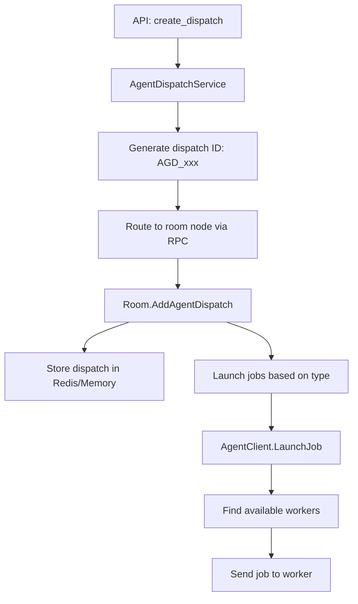

# LiveKit Agent System - Complete Unified Documentation

## Table of Contents

1. [Executive Summary](#executive-summary)
2. [System Architecture Overview](#system-architecture-overview)
3. [Core Components and Concepts](#core-components-and-concepts)
4. [Complete Agent Lifecycle](#complete-agent-lifecycle)
5. [Worker System Deep Dive](#worker-system-deep-dive)
6. [Agent Dispatch and Job Management](#agent-dispatch-and-job-management)
7. [Voice Processing Pipeline](#voice-processing-pipeline)
8. [Server-Side Infrastructure](#server-side-infrastructure)
9. [Communication Protocols](#communication-protocols)
10. [Plugin Ecosystem](#plugin-ecosystem)
11. [Real-World Implementation Examples](#real-world-implementation-examples)
12. [Performance and Scaling](#performance-and-scaling)
13. [Deployment and Operations](#deployment-and-operations)
14. [API Reference Summary](#api-reference-summary)
15. [Common Patterns and Best Practices](#common-patterns-and-best-practices)

---

## Executive Summary

LiveKit Agents is a sophisticated framework for building real-time conversational AI applications. It combines WebRTC infrastructure with modern AI capabilities to create voice assistants, video avatars, and interactive AI experiences.

### System Overview at a Glance

The LiveKit Agent system operates through a coordinated dance between three main components:

1. **LiveKit Server (Go)** - Orchestrates agent dispatch, manages room state, and routes jobs to workers
2. **Agent Workers (Python)** - Long-running processes that accept jobs and spawn agent instances
3. **Agent Instances** - Individual conversation handlers created fresh for each job

### How It Actually Works - Key Discoveries

Based on deep code analysis, here's how the system truly operates:

#### **Worker Lifecycle**
- Workers start with an HTTP health server (port 8081 in production)
- Maintain a pool of pre-warmed processes (0 in dev, 3-4 in production)
- Connect to LiveKit via WebSocket with JWT authentication
- Register with `agent_name` (routing label), job type, and permissions
- Monitor CPU load using 5-sample moving average updated every 0.5s
- Report status (AVAILABLE/FULL) to server every 2.5 seconds
- Dynamically adjust process pool based on load

#### **Agent Dispatch Mechanisms** 
There are THREE ways agents get dispatched:
1. **Explicit API Dispatch** - Direct `CreateDispatch` API call
2. **Room Creation** - Automatic when room created with agent config
3. **Participant Events** - Triggered on join (JT_PARTICIPANT) or publish (JT_PUBLISHER)

#### **Job Assignment Process**
- Server maintains workers in `namespaceWorkers` map by `{agent_name, namespace, job_type}` key
- Uses **weighted random selection** based on load (NOT round-robin)
- Workers can **reject jobs** via custom `request_fnc`
- 7.5-second timeout for assignment confirmation
- Automatic retry with different worker on failure

#### **Critical Implementation Details**
- **Fresh agent instances** created for each job (no state sharing)
- **Process isolation** with memory limits (500MB warning, configurable limit)
- **Windows uses threads** instead of processes by default
- **Inference executor** for ML model sharing across jobs
- **Graceful shutdown** with 30-minute drain timeout
- **Dynamic load balancing** adjusts idle processes based on current load

### Key Characteristics

- **Multi-modal Processing**: Handles audio, video, and text interactions seamlessly
- **Real-time Performance**: Sub-200ms latency for voice interactions
- **Distributed Architecture**: Scalable across multiple workers and nodes
- **Process Isolation**: Each job runs in separate process for stability
- **Plugin Architecture**: 30+ AI provider integrations out of the box

### Core Terminology

- **Worker**: Long-running Python process that manages job execution
- **Agent**: Python class defining conversational behavior (blueprint)
- **Agent Instance**: Actual object created for each job (runtime)
- **Job**: Unit of work assigned to a worker (e.g., handle room X)
- **Dispatch**: Request to launch an agent for a specific room
- **Session**: Active conversation runtime between agent and participants
- **agent_name**: Routing label that determines which workers receive jobs

### Quick Reference - Important Values

| Parameter | Development Mode | Production Mode | Description |
|-----------|-----------------|-----------------|-------------|
| **num_idle_processes** | 0 | 3-4 (CPU-based) | Pre-warmed process pool size |
| **load_threshold** | ∞ (disabled) | 0.7 | Worker marked FULL above this |
| **port** | 0 (random) | 8081 | HTTP health check port |
| **job_memory_warn_mb** | 500 | 500 | Memory warning threshold |
| **job_memory_limit_mb** | 0 (disabled) | 0 (disabled) | Process kill threshold |
| **drain_timeout** | 1800s (30min) | 1800s (30min) | Graceful shutdown timeout |
| **UPDATE_STATUS_INTERVAL** | 2.5s | 2.5s | Worker status report frequency |
| **UPDATE_LOAD_INTERVAL** | 0.5s | 0.5s | CPU load check frequency |
| **ASSIGNMENT_TIMEOUT** | 7.5s | 7.5s | Job assignment timeout |
| **HEARTBEAT_INTERVAL** | 30s | 30s | WebSocket keepalive |
| **initialize_process_timeout** | 10s | 10s | Process startup timeout |
| **shutdown_process_timeout** | 60s | 60s | Process shutdown timeout |

---

## System Architecture Overview

### High-Level Architecture

```
┌─────────────────────────────────────────────────────────────────┐
│                     LiveKit Server (Go)                         │
│  ┌──────────────┐  ┌──────────────┐  ┌──────────────┐         │
│  │   WebRTC     │  │   Agent      │  │     API      │         │
│  │   Engine     │  │   Dispatch   │  │   Server     │         │
│  └──────────────┘  └──────────────┘  └──────────────┘         │
└─────────────────────────────────────────────────────────────────┘
                              │
                    WebSocket + gRPC + HTTP
                              │
┌─────────────────────────────────────────────────────────────────┐
│                Agent Worker Process (Python)                    │
│  ┌──────────────────────────────────────────────────────────┐  │
│  │                    Worker Manager                         │  │
│  │  - WebSocket connection to LiveKit                        │  │
│  │  - Job queue and scheduling                              │  │
│  │  - Process pool management                               │  │
│  │  - Load monitoring and reporting                         │  │
│  └──────────────────────────────────────────────────────────┘  │
│                              │                                  │
│  ┌──────────────────────────────────────────────────────────┐  │
│  │              Job Execution Processes/Threads              │  │
│  │  ┌────────────┐  ┌────────────┐  ┌────────────┐         │  │
│  │  │   Job 1    │  │   Job 2    │  │   Job 3    │         │  │
│  │  │ Room: 101  │  │ Room: 102  │  │ Room: 103  │         │  │
│  │  │            │  │            │  │            │         │  │
│  │  │ Agent()    │  │ Agent()    │  │ Agent()    │         │  │
│  │  └────────────┘  └────────────┘  └────────────┘         │  │
│  └──────────────────────────────────────────────────────────┘  │
└─────────────────────────────────────────────────────────────────┘
                              │
                    Audio/Video Streams
                              │
┌─────────────────────────────────────────────────────────────────┐
│                    Room Participants                            │
│  ┌──────────┐  ┌──────────┐  ┌──────────┐  ┌──────────┐       │
│  │  User 1  │  │  User 2  │  │  User 3  │  │  Agent   │       │
│  └──────────┘  └──────────┘  └──────────┘  └──────────┘       │
└─────────────────────────────────────────────────────────────────┘
```

### Data Flow

```
User Speech → WebRTC → Worker → STT → Text → LLM → Response → TTS → Audio → WebRTC → User
```

---

## Core Components and Concepts

### 1. Worker

A **Worker** is a long-running Python process that:
- Connects to LiveKit server via WebSocket
- Registers capabilities and routing information
- Accepts and executes jobs
- Manages process/thread pools for job execution

**Key Properties:**
```python
class Worker:
    _id: str                        # Unique worker ID (AWR_xxx)
    _agent_name: str                # Routing label for job filtering
    _proc_pool: ProcessPool         # Pool of processes for jobs
    _active_jobs: list[Job]         # Currently running jobs
    _ws_connection: WebSocket       # Connection to LiveKit server
    _status: WorkerStatus          # AVAILABLE or FULL
    _load: float                   # Current load (0.0 to 1.0)
```

### 2. Agent

An **Agent** is a Python class defining conversational behavior:
- Defines STT, LLM, TTS pipeline components
- Implements conversation logic via lifecycle methods
- Handles function tools and external integrations
- Fresh instance created for each job

**Basic Structure:**
```python
class Agent:
    def __init__(self, instructions: str, tools: list = None):
        # Configuration
        
    async def on_enter(self):
        # Called when agent becomes active
        
    async def on_user_turn_completed(self, message):
        # Called after user speaks
        
    async def on_exit(self):
        # Cleanup when agent deactivates
```

### 3. Job

A **Job** is a unit of work:
- Unique ID (AJ_xxx)
- Associated with specific room
- May target specific participants
- Contains authentication token
- Has lifecycle: pending → running → complete/failed

**Job Types:**
- **JT_ROOM**: One job for entire room
- **JT_PARTICIPANT**: One job per participant  
- **JT_PUBLISHER**: Triggered when participant publishes media

### 4. Agent Dispatch

An **Agent Dispatch** is a request to launch an agent:
- Created via API or automatically
- Has unique ID (AGD_xxx)
- Specifies agent_name for routing
- Can include custom metadata
- Creates one or more jobs

### 5. Agent Session

An **Agent Session** manages the conversation runtime:
- Coordinates STT, LLM, TTS pipeline
- Handles turn detection and interruptions
- Manages chat context and history
- Controls audio input/output

---

## Complete Agent Lifecycle

### Phase 1: Worker Startup

```python
# 1. Developer starts worker process
python3 my_agent.py

# 2. Worker initializes
worker = Worker(WorkerOptions(
    entrypoint_fnc=entrypoint,
    agent_name="assistant",
    num_idle_processes=3
))

# 3. Worker connects to LiveKit server
ws_connection = connect_to_livekit()

# 4. Worker registers capabilities
RegisterWorkerRequest {
    agent_name: "assistant",
    type: JT_ROOM,
    version: "1.0.0",
    permissions: {...}
}

# 5. Server responds with worker ID
RegisterWorkerResponse {
    worker_id: "AWR_abc123",
    server_info: {...}
}

# 6. Worker enters ready state
status = WS_AVAILABLE
```

### Phase 2: Job Creation and Dispatch

```python
# Trigger 1: Explicit dispatch via API
await client.agent_dispatch.create_dispatch(
    room="meeting-123",
    agent_name="assistant"
)

# OR Trigger 2: Automatic on participant join
participant_joins_room("meeting-123")

# Server creates job
Job {
    id: "AJ_def456",
    type: JT_ROOM,
    room: "meeting-123",
    agent_name: "assistant"
}
```

### Phase 3: Job Assignment

```
1. Server finds workers with matching agent_name
   key = workerKey{agent_name, namespace, job_type}
   workers = namespaceWorkers[key]

2. Server calculates selection weights based on load
   weights = [max(0, 1 - worker.load) for worker in workers]
   # Weighted random selection, not simple round-robin

3. Server sends availability request to selected worker
   AvailabilityRequest { 
       job: job_details,
       timeout: ASSIGNMENT_TIMEOUT (7.5 seconds)
   }

4. Worker evaluates via request_fnc (can reject!)
   async def request_fnc(job_request):
       if can_handle(job_request):
           await job_request.accept(
               identity="agent_identity",
               name="Agent Name",
               metadata="{}",
               attributes={"key": "value"}
           )
       else:
           await job_request.reject()

5. If accepted, server sends job assignment
   JobAssignment { 
       job: job_details,
       token: "JWT_with_room_permissions",
       url: "ws://specific_node" (optional)
   }

6. Worker tracks assignment in pending_assignments map
   Waits for assignment or timeout (7.5 seconds)
```

### Phase 4: Job Execution

```python
# 1. Worker launches job in process/thread
process = proc_pool.get_idle_process()
process.launch_job(job_info)

# 2. Process calls entrypoint function
async def entrypoint(ctx: JobContext):
    # 3. Connect to room with token
    await ctx.connect()
    
    # 4. Create agent instance
    agent = MyAssistantAgent()
    
    # 5. Initialize session with components
    session = AgentSession(
        vad=silero.VAD.load(),
        stt=deepgram.STT(),
        llm=openai.LLM(),
        tts=elevenlabs.TTS()
    )
    
    # 6. Start agent session
    await session.start(
        agent=agent,
        room=ctx.room
    )
    
    # 7. Agent processes conversation
    # Voice pipeline: Audio → STT → LLM → TTS → Audio
```

### Phase 5: Runtime Processing

```
1. User speaks
   └── Audio captured via WebRTC
   
2. VAD detects speech
   └── Triggers STT processing
   
3. STT transcribes audio
   └── Generates text transcript
   
4. Turn detection determines end of speech
   └── Triggers LLM processing
   
5. LLM generates response
   └── May call function tools
   
6. TTS synthesizes speech
   └── Generates audio frames
   
7. Audio sent to room
   └── Participants hear response
```

### Phase 6: Job Completion

```python
# 1. Conversation ends (user leaves, timeout, error)
session.stop()

# 2. Agent cleanup
await agent.on_exit()

# 3. Disconnect from room
await ctx.room.disconnect()

# 4. Report job status to server
UpdateJobStatus {
    job_id: "AJ_def456",
    status: JS_SUCCESS
}

# 5. Process returns to pool or terminates
proc_pool.return_process(process)
```

---

## Worker System Deep Dive

### Worker Configuration

```python
@dataclass
class WorkerOptions:
    # Core configuration
    entrypoint_fnc: Callable[[JobContext], Awaitable[None]]  # Job handler
    agent_name: str = ""                # Routing label (empty = all jobs)
    
    # Request handling
    request_fnc: Callable[[JobRequest], Awaitable[None]] = _default_request_fnc  # Accept/reject
    prewarm_fnc: Callable[[JobProcess], Any] = _default_initialize_process_fnc   # Initialization
    
    # Resource management
    job_executor_type: JobExecutorType = PROCESS            # PROCESS or THREAD (THREAD on Windows)
    num_idle_processes: int = 0 (dev) / 3-4 (prod)         # Pre-warmed processes
    job_memory_limit_mb: float = 0                         # Memory limit (0 = disabled)
    job_memory_warn_mb: float = 500                        # Warning threshold
    load_threshold: float = inf (dev) / 0.7 (prod)         # Max load before FULL
    
    # Connection
    ws_url: str = "ws://localhost:7880"
    api_key: str = None
    api_secret: str = None
    
    # Timeouts
    drain_timeout: int = 1800                              # 30 minutes graceful shutdown
    shutdown_process_timeout: float = 60.0                 # Process shutdown timeout
    initialize_process_timeout: float = 10.0               # Process init timeout
    
    # HTTP Server
    port: int = 0 (dev) / 8081 (prod)                     # Health check port
```

### Process Pool Management

The worker maintains a pool of processes for job execution:

```python
class ProcPool:
    def __init__(self, 
                 initialize_process_fnc,    # Prewarm function
                 job_entrypoint_fnc,        # Job handler
                 num_idle_processes):       # Pool size
        
        # Spawn idle processes
        for _ in range(num_idle_processes):
            proc = spawn_process()
            proc.initialize()  # Call prewarm
            idle_queue.put(proc)
    
    async def launch_job(self, job_info):
        proc = await idle_queue.get()      # Get warm process
        await proc.execute(job_info)       # Launch job
        active_jobs.add(proc)
```

### Load Management

Workers continuously monitor and report load:

```python
# Load calculation (UPDATE_LOAD_INTERVAL = 0.5s)
class _DefaultLoadCalc:
    def __init__(self):
        self._m_avg = MovingAverage(5)  # 5-sample moving average
        self._cpu_monitor = get_cpu_monitor()
        
    def _calc_load(self):
        # Runs in separate thread
        while True:
            cpu_p = self._cpu_monitor.cpu_percent(interval=0.5)
            self._m_avg.add_sample(cpu_p)
    
    def get_load(self, worker):
        return self._m_avg.get_avg()  # Returns 0.0-1.0

# Dynamic process pool adjustment based on load
if load > load_threshold:
    available_load = max(load_threshold - worker_load, 0.0)
    job_load = worker_load / len(active_jobs)
    available_jobs = min(
        math.ceil(available_load / job_load),
        default_num_idle_processes
    )
    proc_pool.set_target_idle_processes(available_jobs)

# Status update (UPDATE_STATUS_INTERVAL = 2.5s)
UpdateWorkerStatus {
    status: WS_AVAILABLE if load < load_threshold else WS_FULL,
    load: load,  # 0.0-1.0 from CPU moving average
    job_count: len(active_jobs)
}
```

### Agent Name Routing

**Automatic Mode (empty agent_name):**
```python
WorkerOptions(agent_name="")  # Accept ALL jobs
# Jobs created automatically when participants join
```

**Explicit Mode (named agent_name):**
```python
WorkerOptions(agent_name="customer-support")  # Only specific jobs
# Jobs must be explicitly dispatched via API
```

**Load Balancing (multiple workers, same name):**
```python
# Worker 1: agent_name="transcriber", load=30%
# Worker 2: agent_name="transcriber", load=60%
# Worker 3: agent_name="transcriber", load=20%

# Job routed to Worker 3 (lowest load)
```

---

## Agent Dispatch and Job Management

### Dispatch Creation Flow



### Job Creation Triggers

1. **Explicit Dispatch**: API call creates dispatch
2. **Room Creation**: With agent configuration
3. **Participant Join**: For JT_PARTICIPANT jobs
4. **Participant Publish**: For JT_PUBLISHER jobs

### Job Assignment Algorithm

```python
def assign_job(job, workers):
    # 1. Filter compatible workers
    compatible = [w for w in workers 
                  if w.agent_name == job.agent_name
                  and w.type == job.type
                  and w.status == AVAILABLE]
    
    # 2. Calculate selection weights
    weights = [max(0, 1 - w.load) for w in compatible]
    
    # 3. Weighted random selection
    selected = weighted_choice(compatible, weights)
    
    # 4. Send availability request
    response = selected.check_availability(job)
    
    # 5. If accepted, assign job
    if response.accepted:
        selected.assign_job(job)
    else:
        # Try next worker
        retry_with_different_worker()
```

---

## Voice Processing Pipeline

### Pipeline Architecture

```
┌──────────────────────────────────────────────────────────────┐
│                      Voice Pipeline                           │
│                                                               │
│  Input Stage           Processing Stage        Output Stage   │
│  ┌─────────┐          ┌─────────────┐        ┌──────────┐   │
│  │   VAD   │    ┌────►│     STT     │────┐   │   TTS    │   │
│  └─────────┘    │     └─────────────┘    │   └──────────┘   │
│       │         │                         ▼        ▲         │
│  ┌─────────┐    │     ┌─────────────┐             │         │
│  │ Buffer  │────┘     │     LLM     │─────────────┘         │
│  └─────────┘          └─────────────┘                       │
│                              │                               │
│                       ┌──────▼──────┐                        │
│                       │   Context   │                        │
│                       │  Management │                        │
│                       └─────────────┘                        │
└──────────────────────────────────────────────────────────────┘
```

### Component Details

#### 1. Voice Activity Detection (VAD)
- Detects when user is speaking
- Filters out background noise
- Triggers STT processing
- Common implementations: Silero, WebRTC

#### 2. Speech-to-Text (STT)
- Converts audio to text transcription
- Streaming for real-time processing
- Partial and final results
- Providers: Deepgram, AssemblyAI, Google, Azure

#### 3. Turn Detection
- Determines when user has finished speaking
- Three modes:
  - **VAD-based**: Simple silence detection
  - **Model-based**: Semantic completion detection
  - **Hybrid**: Combination for best accuracy

#### 4. Language Model (LLM)
- Processes transcribed text
- Generates conversational responses
- Handles function calling
- Providers: OpenAI, Anthropic, Google, Groq

#### 5. Text-to-Speech (TTS)
- Synthesizes response audio
- Streaming synthesis for low latency
- Voice selection and customization
- Providers: ElevenLabs, OpenAI, Cartesia, PlayAI

### Interruption Handling

```python
# Configuration
allow_interruptions=True
interrupt_speech_duration=0.6     # Min duration to trigger
interrupt_min_words=1              # Min words to interrupt
min_interruption_duration=0.5     # Min interruption length

# False positive recovery
resume_false_interruption=True
false_interruption_timeout=1.5
```

---

## Server-Side Infrastructure

### Agent Dispatch Service (Go)

Handles external API requests:

```go
type AgentDispatchService struct {
    // Create dispatch for room
    CreateDispatch(ctx, req) (*AgentDispatch, error)
    
    // Delete dispatch
    DeleteDispatch(ctx, req) (*AgentDispatch, error)
    
    // List dispatches
    ListDispatch(ctx, req) (*ListAgentDispatchResponse, error)
}
```

### Agent Handler (Go)

Manages worker connections and job routing:

```go
type AgentHandler struct {
    workers map[string]*Worker                    // worker_id -> Worker
    jobToWorker map[JobID]*Worker                // job_id -> Worker
    namespaceWorkers map[workerKey][]*Worker     // Grouped by routing key
    
    // Counters for enabled job types
    roomKeyCount int                             // Workers handling JT_ROOM
    publisherKeyCount int                         // Workers handling JT_PUBLISHER
    participantKeyCount int                       // Workers handling JT_PARTICIPANT
    
    agentNames []string                           // Unique agent names
    namespaces []string                           // Deprecated, for compatibility
}

type workerKey struct {
    agentName string    // Routing label
    namespace string    // Deprecated
    jobType JobType     // JT_ROOM, JT_PUBLISHER, JT_PARTICIPANT
}

// Worker registration creates/updates namespaceWorkers map
// When first worker of a type registers, subscribes to job topics
// When last worker deregisters, unsubscribes from job topics

// Check available agent types
CheckEnabled(ctx, req) (*CheckEnabledResponse, error)

// Request job assignment with retry on failure
JobRequest(ctx, job) (*JobRequestResponse, error)

// Calculate total capacity for job type
JobRequestAffinity(ctx, job) float32
```

### Room Integration

Agents integrate with rooms as special participants:

```go
type Room struct {
    // Add agent dispatch
    AddAgentDispatch(dispatch *AgentDispatch)
    
    // Launch agents for room
    launchRoomAgents(dispatches []*AgentDispatch)
    
    // Launch agents for participants
    launchTargetAgents(dispatches []*AgentDispatch, participant)
}
```

### Storage Layer

**Redis (Production):**
```
agent_dispatch:{room} - Hash of dispatches
agent_job:{room} - Hash of active jobs
worker:{id} - Worker registration data
```

**Local Store (Development):**
```go
type LocalStore struct {
    dispatches map[string][]*AgentDispatch
    jobs map[string][]*Job
    workers map[string]*Worker
}
```

---

## Communication Protocols

### WebSocket Protocol (Worker ↔ Server)

**Worker → Server Messages:**
```protobuf
message WorkerMessage {
    oneof message {
        RegisterWorkerRequest register = 1;
        AvailabilityResponse availability = 2;
        UpdateWorkerStatus update_worker = 3;
        UpdateJobStatus update_job = 4;
        WorkerPing ping = 5;
    }
}
```

**Server → Worker Messages:**
```protobuf
message ServerMessage {
    oneof message {
        RegisterWorkerResponse register = 1;
        AvailabilityRequest availability = 2;
        JobAssignment assignment = 3;
        JobTermination termination = 4;
        WorkerPong pong = 5;
    }
}
```

### Message Flow Sequences

**Registration:**
```
Worker                          Server
  ├── Connect WebSocket ──────────►│
  ├── RegisterWorkerRequest ──────►│
  │◄──── RegisterWorkerResponse ────┤
  ├── UpdateWorkerStatus (periodic)►│
```

**Job Assignment:**
```
Worker                          Server
  │◄──── AvailabilityRequest ──────┤
  ├── AvailabilityResponse ───────►│
  │◄──── JobAssignment ────────────┤
  ├── UpdateJobStatus (periodic)──►│
```

---

## Plugin Ecosystem

### Available Plugins by Category

**Speech-to-Text (STT):**
- Deepgram - Real-time streaming, multiple languages
- AssemblyAI - High accuracy, speaker diarization
- Google Cloud Speech - Wide language support
- Azure Speech Services - Enterprise integration
- AWS Transcribe - Cost-effective option

**Language Models (LLM):**
- OpenAI - GPT-4, GPT-3.5, Realtime API
- Anthropic - Claude 3 family
- Google - Gemini Pro, PaLM
- Groq - Fast inference
- Mistral - Open models

**Text-to-Speech (TTS):**
- ElevenLabs - High quality, voice cloning
- OpenAI - Natural voices, low latency
- Cartesia - Emotional control
- PlayAI - Conversational voices
- Azure Neural Voices - Enterprise quality

**Specialized:**
- Turn Detector - Semantic turn detection
- Browser - Headless browser control
- MCP - Model Context Protocol servers
- Avatars - Bithuman, Simli, Tavus, Hedra

### Creating Custom Plugins

```python
from livekit.agents import stt

class CustomSTT(stt.STT):
    def __init__(self, api_key: str):
        super().__init__()
        self._api_key = api_key
    
    async def recognize(self, buffer: AudioBuffer) -> SpeechEvent:
        # Implementation
        pass
    
    def stream(self) -> SpeechStream:
        return CustomSTTStream(self._api_key)
```

---

## Real-World Implementation Examples

### Example 1: Basic Voice Assistant

```python
from livekit.agents import Agent, AgentSession, WorkerOptions, cli
from livekit.plugins import deepgram, openai, silero

class VoiceAssistant(Agent):
    def __init__(self):
        super().__init__(
            instructions="You are a helpful AI assistant."
        )
    
    async def on_enter(self):
        self.session.generate_reply()

async def entrypoint(ctx: JobContext):
    await ctx.connect()
    
    session = AgentSession(
        vad=silero.VAD.load(),
        stt=deepgram.STT(model="nova-3"),
        llm=openai.LLM(model="gpt-4o-mini"),
        tts=openai.TTS(voice="echo")
    )
    
    await session.start(
        agent=VoiceAssistant(),
        room=ctx.room
    )

if __name__ == "__main__":
    cli.run_app(WorkerOptions(
        entrypoint_fnc=entrypoint,
        agent_name="assistant"
    ))
```

### Example 2: Customer Service Agent with Tools

```python
class CustomerServiceAgent(Agent):
    def __init__(self):
        super().__init__(
            instructions="""You are a customer service representative.
            Help customers with orders and returns."""
        )
    
    @function_tool
    async def lookup_order(self, context: RunContext, order_id: str) -> dict:
        """Look up order details"""
        # Database query
        return {"status": "shipped", "eta": "2 days"}
    
    @function_tool
    async def process_return(self, context: RunContext, order_id: str, reason: str) -> dict:
        """Process a return request"""
        # Create return
        return {"rma_number": "RMA123456", "label_sent": True}
    
    async def on_user_turn_completed(self, turn_ctx, message):
        # Log customer interactions
        logger.info(f"Customer: {message.content}")
```

### Example 3: Multi-Agent Collaboration

```python
# Intake agent handles initial routing
class IntakeAgent(Agent):
    @function_tool
    async def transfer_to_specialist(self, context, specialty: str):
        """Transfer to specialist agent"""
        if specialty == "technical":
            return TechnicalAgent(), "Transferring to technical support..."
        elif specialty == "billing":
            return BillingAgent(), "Transferring to billing..."

# Technical specialist
class TechnicalAgent(Agent):
    def __init__(self):
        super().__init__(
            instructions="You are a technical support specialist."
        )

# Billing specialist  
class BillingAgent(Agent):
    def __init__(self):
        super().__init__(
            instructions="You are a billing specialist."
        )

# Start multiple workers for different agents
python3 intake_worker.py     # agent_name="intake"
python3 technical_worker.py  # agent_name="technical"
python3 billing_worker.py    # agent_name="billing"
```

### Example 4: Real-time API Integration

```python
from livekit.plugins.openai import realtime

class RealtimeAgent(Agent):
    def __init__(self):
        super().__init__(
            instructions="Natural conversation assistant",
            llm=realtime.RealtimeModel(
                voice="echo",
                temperature=0.8,
                turn_detection=realtime.TurnDetection(
                    type="server_vad",
                    threshold=0.5
                )
            )
        )

# ~200ms latency with direct audio processing
```

---

## Performance and Scaling

### Latency Optimization Strategies

1. **Process Prewarming:**
```python
def prewarm(proc: JobProcess):
    proc.userdata["vad"] = silero.VAD.load()
    proc.userdata["models"] = preload_models()

WorkerOptions(
    prewarm_fnc=prewarm,
    num_idle_processes=4
)
```

2. **Streaming Everything:**
- Stream STT partial results
- Stream LLM tokens as generated
- Stream TTS audio chunks
- Never wait for complete responses

3. **Regional Deployment:**
- Deploy workers close to users
- Use regional API endpoints
- CDN for static resources

### Scaling Patterns

**Horizontal Scaling:**
```bash
# Start multiple workers
for i in {1..10}; do
    python3 agent.py &
done
```

**Load Distribution:**
```python
# Automatic load balancing
# Workers with same agent_name share load
# Server routes to least loaded worker
```

**Auto-scaling:**
```python
def should_scale_up(metrics):
    return (
        metrics.avg_load > 0.8 or
        metrics.queue_depth > 10 or
        metrics.p99_latency > 2000  # ms
    )
```

### Resource Management

```python
WorkerOptions(
    # Memory limits
    job_memory_limit_mb=500,
    job_memory_warn_mb=400,
    
    # Process limits
    num_idle_processes=3,
    max_jobs=10,
    
    # Load thresholds
    load_threshold=0.7
)
```

---

## Deployment and Operations

### Development Setup

```bash
# Install dependencies
pip install "livekit-agents[local]"

# Environment variables
export LIVEKIT_URL=ws://localhost:7880
export LIVEKIT_API_KEY=devkey
export LIVEKIT_API_SECRET=secret

# Run in dev mode with hot reload
python agent.py dev
```

### Production Deployment

**Docker:**
```dockerfile
FROM python:3.11-slim
WORKDIR /app
COPY requirements.txt .
RUN pip install -r requirements.txt
COPY . .
CMD ["python", "agent.py", "start"]
```

**Kubernetes:**
```yaml
apiVersion: apps/v1
kind: Deployment
metadata:
  name: livekit-agent
spec:
  replicas: 3
  template:
    spec:
      containers:
      - name: agent
        image: your-registry/agent:latest
        env:
        - name: LIVEKIT_URL
          valueFrom:
            secretKeyRef:
              name: livekit-secrets
              key: url
        resources:
          requests:
            memory: "500Mi"
            cpu: "500m"
          limits:
            memory: "1Gi"
            cpu: "1000m"
```

### Monitoring and Health Checks

**Worker HTTP Endpoints:**
```python
GET /          # Health check (200 OK or 503)
GET /worker    # Worker info (agent_name, jobs, etc)
```

**Prometheus Metrics:**
```python
WorkerOptions(
    prometheus_port=9090  # Expose metrics
)

# Available metrics:
# - agent_requests_total
# - agent_response_time_seconds
# - stt_duration_seconds
# - llm_tokens_total
# - tts_characters_total
```

---

## API Reference Summary

### Python SDK - Worker APIs

```python
# Main classes
Worker(opts: WorkerOptions)
Agent(instructions: str, tools: list)
AgentSession(vad, stt, llm, tts)
JobContext(room, participant, proc)

# Key methods
await ctx.connect()
await session.start(agent, room)
await session.generate_reply()
await job_request.accept()
```

### LiveKit Server - Agent APIs

```python
# Agent dispatch
await client.agent_dispatch.create_dispatch(
    room="room-name",
    agent_name="assistant"
)

await client.agent_dispatch.list_dispatch(
    room_name="room-name"
)

await client.agent_dispatch.delete_dispatch(
    room="room-name",
    dispatch_id="AGD_xxx"
)
```

### Internal Server APIs (Go)

```go
// Check available agents
CheckEnabled() (*CheckEnabledResponse, error)

// Get job affinity
JobRequestAffinity(job) float32

// Request job assignment
JobRequest(job) (*JobRequestResponse, error)
```

---

## Common Patterns and Best Practices

### 1. Agent Naming Strategy

```python
# Environment-based
WorkerOptions(agent_name=f"assistant-{ENV}")  # assistant-prod

# Feature-based
WorkerOptions(agent_name="transcriber")       # Single purpose

# Version-based
WorkerOptions(agent_name="assistant-v2")      # Gradual rollout
```

### 2. Error Handling

```python
class RobustAgent(Agent):
    async def on_error(self, error: Exception):
        logger.error(f"Agent error: {error}")
        await self.session.say("I encountered an issue. Let me try again.")
        
    async def on_user_turn_completed(self, turn_ctx, message):
        try:
            # Process normally
            pass
        except Exception as e:
            await self.on_error(e)
```

### 3. Context Management

```python
class ContextAwareAgent(Agent):
    def __init__(self):
        super().__init__(
            instructions="...",
            chat_ctx=self.load_context()  # Load previous context
        )
    
    async def on_exit(self):
        await self.save_context()  # Persist for next session
```

### 4. Testing Strategy

```python
# Unit test
async def test_agent_response():
    agent = MyAgent()
    response = await agent.process_input("Hello")
    assert "greeting" in response.lower()

# Integration test
async def test_full_conversation():
    async with AgentSession() as session:
        await session.start(MyAgent())
        result = await session.run("Book a table")
        assert result.contains_function_call("book_table")
```

### 5. Performance Tips

- **Prewarm everything possible** - Models, tokenizers, VAD
- **Use streaming APIs** - Never wait for complete responses
- **Cache common responses** - Greetings, FAQs
- **Monitor metrics** - Track latency at each stage
- **Scale horizontally** - Multiple workers over bigger workers

---

## Conclusion

The LiveKit Agent system provides a comprehensive framework for building scalable, real-time conversational AI applications. Its key strengths include:

1. **Distributed Architecture** - Scale across multiple workers and nodes
2. **Process Isolation** - Stability through job isolation
3. **Real-time Performance** - Optimized for low latency
4. **Flexible Routing** - Automatic and explicit dispatch modes
5. **Rich Plugin Ecosystem** - 30+ integrations out of the box

The system elegantly separates concerns:
- **Workers** handle infrastructure and scaling
- **Agents** define conversation behavior
- **Jobs** encapsulate units of work
- **Sessions** manage runtime state

This architecture enables developers to focus on building conversational experiences while the framework handles the complexities of real-time communication, process management, and scalable deployment.