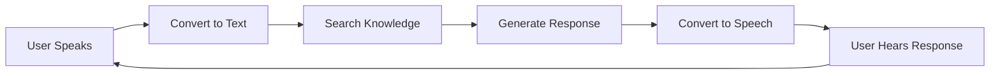

# LiveKit Worker Lifecycle Guide

> **A beginner-friendly explanation of how our voice agent system works, from user request to conversation**

## 🎯 What This Guide Covers

This guide explains how our system handles voice conversations with AI personas. Think of it like a restaurant:
- **The Customer** (User) wants to talk to a specific chef (Persona)
- **The Host** (API) takes the reservation and assigns a table
- **The Manager** (Orchestrator) ensures a waiter is available
- **The Waiter** (Worker) serves all tables but knows each customer's preferences
- **The Service** (Agent) is personalized for each table

---

## 📚 Core Concepts First

### What is a Worker?
A **Worker** is a Python program that runs continuously in the background, waiting to handle voice conversations. Think of it as a receptionist who can handle multiple phone calls, switching between them as needed.

### What is an Agent?
An **Agent** is a conversation handler created for each user. If the Worker is the receptionist, the Agent is the actual phone conversation with one specific caller.

### What is a Persona?
A **Persona** is a digital personality - like "John the Software Engineer" or "Sarah the Marketing Expert". It includes their knowledge, speaking style, and personality traits.

### The Key Design Decision
**We use ONE Worker for ALL users** - like having one very capable receptionist instead of hiring one per caller. This saves resources but means if the receptionist gets sick, all calls stop.

---

## 🔄 The Complete Lifecycle: Step by Step

### Phase 1: User Wants to Start a Voice Chat

**What the user does:**
```
User clicks "Start Voice Chat" with John Doe on the website
```

**What happens behind the scenes:**
1. The website sends a request to our API: "User wants to talk to John Doe"
2. The API checks: "Does John Doe exist in our database?"
3. If yes, the API creates a unique "room" for this conversation
4. Think of it like booking a private conference room for a meeting

**In simple terms:** 
User says "I want to talk to John" → System says "OK, let me set up a room for you two"

---

### Phase 2: Ensuring Someone Can Handle the Call

**The Orchestrator's Job:**
```
"Is our worker (receptionist) at their desk and ready?"
```

**Three possible scenarios:**

1. **Worker is healthy and ready**
   - Great! Move to Phase 3
   
2. **No worker exists**
   - Start a new worker process (hire a receptionist)
   - Wait for them to be ready
   - This takes about 5-10 seconds
   
3. **Worker exists but isn't responding**
   - The worker might have crashed
   - Try to clean up the old one
   - Start a fresh worker
   - This is like replacing a sick receptionist

**In simple terms:**
System checks "Is someone available to handle calls?" → If not, it starts the call handler program

---

### Phase 3: Starting the Worker (If Needed)

**What is actually happening:**
```
Starting a Python program that connects to LiveKit and waits for users
```

**The startup process:**
1. **Launch the program**
   - Like turning on a computer and opening the call center software
   
2. **Load configuration**
   - API keys for AI services (OpenAI, ElevenLabs for voice)
   - Database connection details
   - LiveKit connection credentials
   
3. **Connect to LiveKit**
   - LiveKit is the video/audio streaming service
   - Worker says "I'm ready to handle conversations"
   
4. **Register in database**
   - Save: "Worker #123 started at 3:00 PM on port 8080"
   - This helps track if the worker is still alive

**In simple terms:**
Starting the worker = Opening the call center for business

---

### Phase 4: Routing the User to the Worker

**Creating the connection:**
```
"Send any user joining Room ABC to our worker"
```

**What happens:**
1. **Orchestrator tells LiveKit**
   - "When someone joins room 'john-doe-room-456', send them to our worker"
   - This is called creating a "dispatch"
   
2. **API gives user a ticket**
   - Returns: room name, access token, and connection details
   - Like giving them a conference call dial-in number and passcode
   
3. **Track the active room**
   - Database records: "Room 456 is being handled by Worker 123 for John Doe"

**In simple terms:**
System creates a virtual meeting room and tells the worker "You'll be handling this one"

---

### Phase 5: User Connects, Agent is Created

**When the user's browser connects:**
```
User joins the LiveKit room → Worker is notified → Creates an Agent
```

**The Agent creation process:**

1. **Worker receives notification**
   - "Someone just joined room 'john-doe-room-456'"
   
2. **Extract persona information**
   - Who should I be? "John Doe"
   - Check the user's metadata for details
   
3. **Load John Doe's personality**
   - Fetch from database:
     - Basic info (name, role, company)
     - Personality patterns (how John talks)
     - Custom instructions (John's unique style)
     - Voice settings (John's ElevenLabs voice ID)
   
4. **Initialize conversation tools**
   - RAG system (to search John's knowledge)
   - Speech recognition (Deepgram)
   - AI model (GPT-4)
   - Voice synthesis (ElevenLabs with John's voice)
   
5. **Start the conversation**
   - Agent says: "Hey! I'm John Doe, Software Engineer. How can I help you today?"

**In simple terms:**
User joins the call → System loads John's personality → Conversation begins with John's voice and knowledge

---

### Phase 6: The Conversation Loop

**For each thing the user says:**



**Detailed breakdown:**

1. **User speaks**
   - "What's your experience with Python?"
   
2. **Speech to text** (Deepgram)
   - Audio → "What's your experience with Python?"
   
3. **Search John's knowledge** (RAG)
   - Find relevant information from John's uploaded content
   - "John has 10 years of Python experience, worked on Django projects..."
   
4. **Generate response** (GPT-4)
   - Combine: John's personality + Found knowledge + Question
   - Generate: "I've been working with Python for about 10 years..."
   
5. **Text to speech** (ElevenLabs)
   - Use John's voice to speak the response
   
6. **User hears John's voice**
   - Natural conversation continues

**In simple terms:**
User talks → AI understands → Searches persona's knowledge → Responds in persona's voice

---

### Phase 7: Conversation Ends

**When the user disconnects:**

1. **Agent cleanup**
   - Save conversation summary (if configured)
   - Release resources
   - Say goodbye
   
2. **Room cleanup**
   - Remove room from active rooms table
   - Update worker's active job count
   
3. **Worker continues**
   - Worker stays running, ready for next user
   - Like a receptionist hanging up one call and waiting for the next

**In simple terms:**
Call ends → Clean up this conversation → Stay ready for next caller

---

## 🏗️ System Architecture (Simple View)

```
┌──────────────────────────────────────────────────┐
│                     Users                         │
│  (Multiple people wanting to chat with personas)  │
└──────────────────────────────────────────────────┘
                         │
                         ▼
┌──────────────────────────────────────────────────┐
│                  Web Application                  │
│            (Frontend - What users see)            │
└──────────────────────────────────────────────────┘
                         │
                         ▼
┌──────────────────────────────────────────────────┐
│                    Our API                        │
│         (Handles requests, validates users)       │
└──────────────────────────────────────────────────┐
                         │
                         ▼
┌──────────────────────────────────────────────────┐
│              PersonaOrchestrator                  │
│         (Manages THE single worker)               │
└──────────────────────────────────────────────────┘
                         │
                         ▼
┌──────────────────────────────────────────────────┐
│               The Worker Process                  │
│      (Python program running continuously)        │
│                                                   │
│  ┌────────────┐ ┌────────────┐ ┌────────────┐   │
│  │  Agent 1   │ │  Agent 2   │ │  Agent 3   │   │
│  │ (For User1)│ │ (For User2)│ │ (For User3)│   │
│  └────────────┘ └────────────┘ └────────────┘   │
└──────────────────────────────────────────────────┘
                         │
                         ▼
┌──────────────────────────────────────────────────┐
│               External Services                   │
│  - Database (PostgreSQL)                         │
│  - LiveKit (Audio/Video streaming)               │
│  - OpenAI (AI responses)                         │
│  - ElevenLabs (Voice synthesis)                  │
│  - Deepgram (Speech recognition)                 │
└──────────────────────────────────────────────────┘
```

---

## ⚠️ Important Design Decisions

### Why Only One Worker?

**Pros:**
- **Simple** - Easy to understand and debug
- **Resource efficient** - One process, shared memory
- **Cost effective** - Minimal server resources

**Cons:**
- **Single point of failure** - Worker dies = all conversations stop
- **No load balancing** - One worker handles everyone
- **Manual recovery** - Someone must restart if it crashes

### What Happens When Things Go Wrong?

1. **Worker crashes mid-conversation**
   - All active conversations disconnect
   - Users see "Connection lost"
   - Someone must manually restart the worker
   - Users can reconnect after restart

2. **Database connection lost**
   - New conversations can't start
   - Existing conversations might continue briefly
   - System can't load persona data

3. **LiveKit connection issues**
   - Audio/video stops working
   - Conversations freeze
   - Usually auto-recovers

---

## 🔑 Key Takeaways

1. **One Worker, Many Agents**
   - The Worker is like a call center
   - Each Agent is like an individual phone call
   - One Worker can handle many Agents simultaneously

2. **Dynamic Persona Loading**
   - Personas aren't pre-loaded
   - Each conversation loads the persona fresh from database
   - This means personas can be updated without restarting

3. **Stateless Conversations**
   - Each conversation is independent
   - No memory between sessions (yet)
   - Clean slate for each chat

4. **Simple but Fragile**
   - Easy to understand and maintain
   - But one failure affects everyone
   - Good for development, risky for production

---

## 🚀 Next Steps

### For Developers
1. Read the [technical implementation guide](./ACTUAL_IMPLEMENTATION_GUIDE.md) for code details
2. Check the [database schema](../API_DOCUMENTATION.md) for data structure
3. Review the [error handling patterns](./ACTUAL_AGENT_SYSTEM_GUIDE.md) for debugging

### For System Administrators
1. Monitor the worker health endpoint: `GET /api/v1/livekit/health`
2. Set up alerts for worker crashes
3. Document restart procedures

### For Product Teams
1. Understand the current limitations (single worker)
2. Plan for scaling needs
3. Consider user impact of worker failures

---

## 📖 Glossary

- **Worker**: The Python process that handles all voice conversations
- **Agent**: A conversation instance for one user
- **Persona**: The AI personality (knowledge + voice + style)
- **Orchestrator**: The manager that ensures the worker is running
- **Room**: A virtual space for one conversation
- **Dispatch**: The routing rule that sends users to workers
- **RAG**: Retrieval-Augmented Generation (searching persona's knowledge)
- **LiveKit**: The service that handles audio/video streaming

---

## 💡 Frequently Asked Questions

**Q: Why don't we start one worker per persona?**
A: Resources. Each worker uses memory and CPU. With 100 personas, we'd need 100 processes running constantly, even if nobody's talking.

**Q: Can we add more workers for scaling?**
A: Not with the current design. The system assumes ONE worker. Adding more would require significant changes to the orchestrator.

**Q: What happens to ongoing conversations during deployment?**
A: They disconnect. Users see "Connection lost" and must reconnect after the new version starts.

**Q: How quickly can a crashed worker recover?**
A: Currently, it doesn't auto-recover. Someone must manually restart it. This takes about 30 seconds once noticed.

**Q: Can two users talk to the same persona simultaneously?**
A: Yes! The single worker creates separate agents for each user. They don't interfere with each other.

---

This guide explains the lifecycle without drowning you in code. For technical implementation details, see the [technical guide](./ACTUAL_IMPLEMENTATION_GUIDE.md).